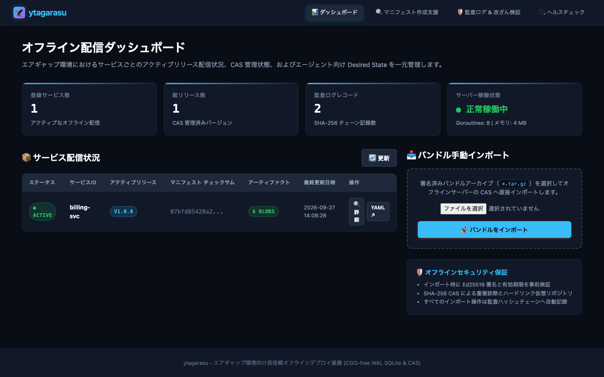
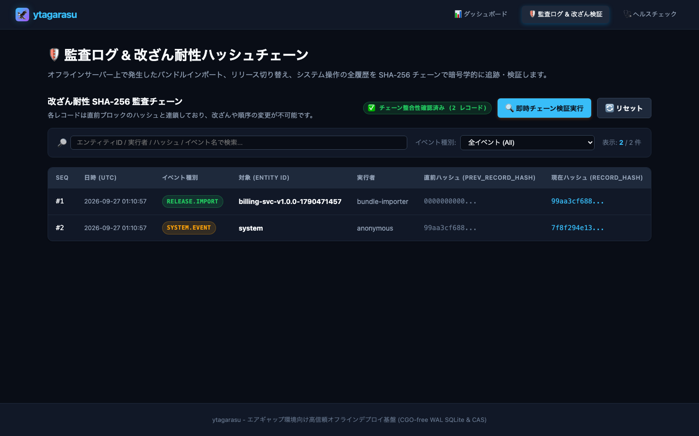

# 🦅 ytagarasu (八咫烏)

[](https://github.com/sh0jitmy/ytagarasu/actions/workflows/ci.yml)
[](LICENSE)
[](https://goreportcard.com/report/github.com/sh0jitmy/ytagarasu)

**ytagarasu（八咫烏）** は、インターネット接続が完全に遮断された**エアギャップ（完全オフライン）環境**のための、高信頼・自律型デプロイメント基盤プラットフォームです。

金融・医療・エネルギー・制御システム・製造工場などの閉域ネットワークにおいて、再帰的依存解決済みパッケージ、アプリケーション成果物、設定テンプレート、TLS 証明書をひとつの暗号署名付きバンドルにまとめ、物理メディア搬送からサーバー配布、クライアントエージェントによる自動適用・ロールバック・監査トレースまでをエンドツーエンドで完結させます。

---

## 🏛️ 全体アーキテクチャ

```
 [ オンライン・ビルド環境 ]
        │
        ├── 1. manifest.yaml 定義 & 事前リスク評価 (ytagarasu manifest init / eval)
        ├── 2. APT / RPM 依存関係の再帰的解決 & キャッシュ (pkgengine)
        ├── 3. Ed25519 デジタル署名 & フル/差分バンドル生成 (ytagarasu bundle export)
        │
 ═══════╪════════════════════════════════════════════════════════════════════════
        │  物理メディア搬送 (USB / 外付け暗号化ストレージ)
 ═══════╪════════════════════════════════════════════════════════════════════════
        ▼
 [ オフライン・エアギャップ環境 ]
        │
   ┌────┴───────────────────────────────────────────────────────────────────┐
   │ 4. オフライン成果物サーバー (ytagarasu-server)                          │
   │    ├── 署名・有効期限の検証パイプライン                                 │
   │    ├── コンテンツアドレス可能ストレージ (SHA-256 CAS)                  │
   │    ├── CGO-free WAL SQLite リリース管理 & 仮想リポジトリ (/repos/...)   │
   │    ├── 改ざん耐性 SHA-256 監査ハッシュチェーン (/api/v1/audit/...)     │
   │    └── Node.js不要の組み込み HTMX ダッシュボード (/ui)                 │
   └────┬───────────────────────────────────────────────────────────────────┘
        │ HTTP (Desired State Polling)
        ▼
   ┌────────────────────────────────────────────────────────────────────────┐
   │ 5. 自律型デプロイエージェント (ytagarasu-agent)                        │
   │    ├── flock 多重実行ガードによる競合防止                              │
   │    ├── 非対話的パッケージインストール (DEBIAN_FRONTEND / -y)           │
   │    ├── Go text/template 設定ファイル動的レンダリング                   │
   │    ├── validateCommand による反映前構文検証 (nginx -t 等)             │
   │    ├── renameat 不可分更新 & 失敗時の即座スナップショット復元          │
   │    └── HTTP / コマンドによるポスト健全性プローブ (HealthCheck)         │
   └────────────────────────────────────────────────────────────────────────┘
```

---

## ✨ 主要機能

1. **📦 再帰的パッケージ依存解決 & バンドル化**:
   - APT (`dpkg`, `apt-get`) および RPM/DNF の推移的依存パッケージをインターネット側で再帰的に解決・一括ダウンロード。
   - アプリケーションバイナリ、設定テンプレート、静的アセットを単一の暗号化アーカイブ (`.tar.gz`) へ集約。
2. **🛡️ 暗号学的完全性 & 有効期限検証**:
   - Ed25519 によるデジタル署名と公開鍵検証。改ざんされたバンドルはインポート段階で即座に遮断。
   - マニフェスト内の有効期限（`ExpiresAt`）チェックによる誤搬送・リプレイアタックの防止。
3. **🔗 改ざん耐性 SHA-256 監査ハッシュチェーン**:
   - バンドルインポート、リリース切り替え、エージェントデプロイ結果の全履歴を直前ブロックのハッシュと連鎖記録。
   - ジェネシスブロックからの数学的完全性を即時検証可能（Web UI および `ytagarasu audit verify` CLI）。
4. **⚡ 差分バンドル（Delta Bundle）エンジン**:
   - 前バージョンとの差分を自動検知し、追加・変更されたファイルのみを収録（データ転送量を 80〜99% 削減）。
   - サーバーの CAS（重複排除ブロブストレージ）から未変更ファイルを自動再利用。
5. **🔄 アトミック設定管理 & 自動ロールバック**:
   - Go `text/template` による環境変数・ポート等の動的展開。
   - 反映前の構文検証 (`validateCommand`)、一時ファイル書き出し後の `renameat` アトミックリプレイス。
   - ヘルスチェック失敗時の即座スナップショット復元（ゼロ人手介入）。
6. **📊 組み込み HTMX ダッシュボード (Node.js/npm 完全不要)**:
   - `//go:embed` によりアセット（HTMX、CSS）を Go 単一バイナリに内包。外部 CDN 接続ゼロ。
   - サービス一覧、Desired State、稼働メトリクス、監査ログ、バンドル手動インポートを Web ブラウザから確認可能。
7. **🤖 初期ブートストラップ Ansible Role**:
   - `roles/deploy_agent/` により、ベアメタルや仮想マシンへの `ytagarasu-agent` のバイナリ配置、設定展開、systemd ユニット登録を自動化。

---

## 📸 スクリーンショット

| HTMX ダッシュボード (`/ui`) | 監査ログ & 改ざん耐性ハッシュチェーン (`/ui/audit`) |
| :---: | :---: |
|  |  |

---

## 🚀 5分で体験するクイックスタート

### 1. リポジトリのクローン & ビルド
```bash
git clone https://github.com/sh0jitmy/ytagarasu.git
cd ytagarasu
make build
```
`bin/` ディレクトリに以下の実行バイナリが生成されます：
- `bin/ytagarasu`: バンドル作成・検証・監査 CLI
- `bin/ytagarasu-server`: オフライン成果物サーバー & HTMX ダッシュボード
- `bin/ytagarasu-agent`: ノード常駐デプロイエージェント

### 2. 成果物サーバーの起動
```bash
./bin/ytagarasu-server --listen :8080 --data-dir ./data/server
```
ブラウザで `http://localhost:8080/ui` にアクセスすると、組み込みダッシュボードが表示されます。

### 3. バンドル署名用の鍵ペア生成
```bash
./bin/ytagarasu keygen -d ./keys
```

### 4. サンプルバンドルの作成・署名・エクスポート
```bash
./bin/ytagarasu bundle export \
    --manifest examples/manifest.yaml \
    --source examples/ \
    --output ./bundle-v1.0.0.tar.gz \
    --key ./keys/private.key \
    --force
```

### 5. サーバーへのバンドルインポート
Web UI（`http://localhost:8080/ui`）からファイルをドラッグ＆ドロップするか、curl でアップロードします：
```bash
curl -X POST http://localhost:8080/api/v1/bundles/import \
    -F "bundle=@./bundle-v1.0.0.tar.gz"
```

### 6. クライアントエージェントによる適用
```bash
./bin/ytagarasu-agent \
    --server http://localhost:8080 \
    --service billing-svc \
    --once
```

### 7. 監査ハッシュチェーンの改ざん検証
```bash
./bin/ytagarasu audit verify --server http://localhost:8080
```
`✅ Audit trail is VALID and tamper-free!` と表示され、完全性が確認できます。

---

## 🧪 多層 E2E テストフレームワーク

本リポジトリは、閉域環境における極めて高い信頼性を担保するため、4層の E2E テストスイートを完備しています：

| レイヤー | コマンド | 検証内容 |
| :--- | :--- | :--- |
| **Layer 1** | `make test` | 単体・結合テスト（`-race`、メモリDB分離、カバレッジ 100%） |
| **Layer 2** | `make sqlite-e2e` | No-Docker スタンドアロン SQLite ガバナンス・バックアップ検証 |
| **Layer 3** | `make ytagarasu-e2e` | **Agent-Server 実機デプロイ動作 & HTMX UI 一括 E2E 検証** |
| **Layer 4** | `make frontend-e2e` | Headless Chrome による自動スナップショット撮影 & HTML レポート |

```bash
# Agent-Server 実機動作および HTMX UI の完全な E2E テストを実行
make ytagarasu-e2e
```

---

## 📖 ユーザーマニュアル & ドキュメント

より詳細な運用手順、設定リファレンス、およびトラブルシューティングについては、以下のマニュアルを参照してください：

- 📘 **[詳細ユーザーマニュアル (docs/manual.md)](docs/manual.md)**:
  - エンドツーエンドの運用フロー（オンライン作成からオフライン適用）
  - 差分バンドルの作成・運用方法
  - Ansible による初期導入手順
  - 設定構文事前検証と自動ロールバックの設計
  - 監査チェーンの仕組みと復旧手順
  - CLI コマンドおよび設定ファイル（YAML）完全リファレンス

---

## 📄 ライセンス

Apache License 2.0 - 詳細は [LICENSE](LICENSE) を参照してください。
