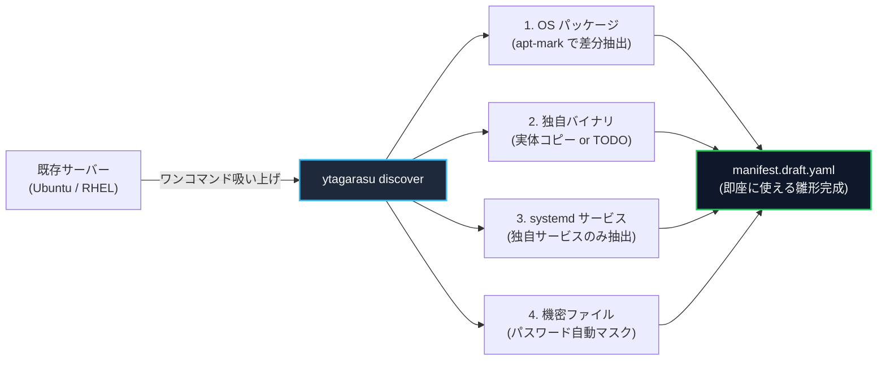

<!--
Copyright 2026 [Copyright Holder]

Licensed under the Apache License, Version 2.0 (the "License");
you may not use this file except in compliance with the License.
You may obtain a copy of the License at

    http://www.apache.org/licenses/LICENSE-2.0

Unless required by applicable law or agreed to in writing, software
distributed under the License is distributed on an "AS IS" BASIS,
WITHOUT WARRANTIES OR CONDITIONS OF ANY KIND, either express or implied.
See the License for the specific language governing permissions and
limitations under the License.

Author: [YOUR_NAME]
-->

# マニフェスト作成支援機能（リバースエンジニアリング & インベントリ検出）設計書

> [!NOTE]
> **レビュアー向けクイックガイド**:
> 本書は、既存稼働サーバーからパッケージやバイナリ構成を吸い上げて `manifest.yaml` を自動生成する機能（`ytagarasu discover`）の設計書です。
> まずは **[1. 3分でわかる全体像 (TL;DR)](#1-3分でわかる全体像-tldr)** と **[3. 「落とし所」3つの選択肢とおすすめ](#3-落とし所3つの選択肢とおすすめ)** をご覧ください。

---

## 1. 3分でわかる全体像 (TL;DR)

### なぜこの機能が必要か？（課題）
- 既存のサーバーには、手動導入した OS パッケージ、独自バイナリ、systemd サービス、設定ファイルが混在しています。
- これらを人間が手作業で調べて `manifest.yaml` を書くのは大変で、漏れが発生します。

### 「バイナリの元リポジトリが分からない問題」への結論（落とし所）
> **結論**: **「実体吸い上げモード」をデフォルト（主軸）にします。**
> リポジトリ URL が不明でも、**「サーバー上にある動いているバイナリそのもの」を吸い上げてバンドルに取り込めば、即座に動くオフラインバンドルが完成します。**
> （CI/CD と正規に紐付けたい場合は、TODO コメントを出力する「プレースホルダーモード」も選択可能です）



---

## 2. Before / After で見るユーザー体験 (UX)

### これまで（手作業）
1. `dpkg -l` や `systemctl` を叩いて、何が入っているかをメモ帳に書き出す。
2. OS 初期パッケージと、業務に必要なパッケージの区別がつかず混乱する。
3. `/usr/local/bin` のバイナリがどこから来たか分からず、マニフェストが書けない。
4. `/etc` の設定ファイルをコピーしたら、平文パスワードが混入してしまう。

### `ytagarasu discover` 導入後（自動吸い上げ）
サーバー上でコマンドを 1 行実行するだけです：

```bash
# サーバー構成を吸い上げ、ドラフトマニフェストを出力
ytagarasu discover -o manifest.draft.yaml
```

#### ターミナル出力イメージ
```text
$ ytagarasu discover -o manifest.draft.yaml
================================================================
   🦅 ytagarasu System Discovery & Manifest Assistant
================================================================
✔ [1/4] OS & Targets:     Ubuntu 24.04 (amd64)
✔ [2/4] OS Packages:      42 個の個別導入パッケージを検出 (基本OSを除外)
✔ [3/4] 稼働サービス:      2 個の独自 systemd サービスを検出
✔ [4/4] 独自バイナリ:      1 個の実行ファイルを検出 (/usr/local/bin/worker)
✔ [安全] 機密サニタイズ:   /etc/app.conf 内のパスワードを自動マスク保護

🎉 マニフェスト雛形を出力しました: manifest.draft.yaml
👉 次のステップ: 内容を確認して 'ytagarasu manifest eval -m manifest.draft.yaml' を実行してください
```

---

## 3. 「落とし所」3つの選択肢とおすすめ

サーバー上に配置されているバイナリの元ストア/リポジトリが分からない問題に対する、3 つのアプローチ比較です。

| 選択肢 | 動作概要 | メリット | デメリット | おすすめの場面 |
| :--- | :--- | :--- | :--- | :--- |
| **【推奨】モード A<br/>実体吸い上げモード**<br/>*(Local Ingestion)* | サーバー上の**現行バイナリそのものを吸い上げて、バンドルの `artifacts/` に直コピー**する | **元リポジトリが不明でも即座に完全なオフラインバンドルが完成する** | バンドルサイズが大きくなる | **レガシーサーバーの移行、元リポジトリが不明な内製ツールのオフライン化** |
| **モード B<br/>TODO ヒントモード**<br/>*(Placeholder)* | `artifact: "TODO: ..."` とし、SHA-256 やファイルサイズ、systemd 名をコメントで出力 | マニフェストが軽量で、CI/CD や S3 と綺麗に連携できる | 人間が手動で S3 やビルド成果物のパスを埋める必要がある | **CI/CD パイプラインが整備されている近代的な環境** |
| **モード C<br/>設定ファイル逆引き**<br/>*(Static Reverse)* | systemd の `ExecStart` やスクリプト内を検索し、`dewy pull` や `curl/S3` URL を探す | 見つかれば完全自動で S3/Dewy とマッピングできる | スクリプトの書き方に依存し、100% の検知は保証できない | **モード A または B の補助機能（自動判定）** |

> [!TIP]
> **推奨設計**:
> **デフォルトは「モード A（実体吸い上げ）」または「モード B（ヒント出力）」をフラグで切り替え可能**にします。
> - `ytagarasu discover -o manifest.yaml --ingest` &rarr; モード A（即座に動くバンドルを生成）
> - `ytagarasu discover -o manifest.draft.yaml` &rarr; モード B（レビュー用ドラフトを出力）

---

## 4. 除外ルール (`.ytagarasuignore`) と 3 つの安心設計

既存サーバーを吸い上げる際、余計なファイルが入らないよう Git 互換の除外設定を提供します。

### ① `.ytagarasuignore` の記述例
カレントディレクトリまたは `/etc/ytagarasu/` に置くだけで自動適用されます。
```gitignore
# 1. 除外したいディレクトリ
/var/lib/docker/*
/opt/backup/*

# 2. 除外したいパッケージ (業務に関係ないツール)
@package:vim
@package:tmux
@package:htop

# 3. 除外したいサービス (OS標準サービス)
@service:sshd.service
@service:cron.service
```

### ② 3 つの安心設計（SRE & セキュリティ観点）
1. **完全読み取り専用 (Read-Only)**:
   - スキャン処理はサーバーの状態や稼働中プロセスに一切変更を加えません。
2. **本番無影響の超低負荷**:
   - CPU 使用率 5% 未満、メモリ 64MB 未満で動作し、本番稼働中のサーバーでも安全に実行できます。
3. **機密情報の自動マスキング (SIRT)**:
   - `/etc` 内の設定ファイル（`.conf`, `.yaml`, `.env` 等）に含まれるパスワードやトークン、秘密鍵（`*.pem`, `*.key`）を自動検知し、`<REDACTED_SECRET>` に置換して漏洩を防ぎます。

---

## 5. レビュアーへの確認事項（意思決定ポイント）

以下の 3 点について、ご意見やご希望の方向性をご確認いただけますでしょうか。

1. **基本方針**:
   - バイナリのストア不明時の落とし所として、**「実体吸い上げ（モードA）」と「TODOヒント（モードB）」の併用**で進めてよろしいでしょうか？
2. **コマンド形式**:
   - 常駐エージェントではなく、単一の CLI サブコマンド **`ytagarasu discover`** として提供する方針でよろしいでしょうか？（運用者が一時的に実行しやすいため）
3. **除外ルール**:
   - `.ytagarasuignore` によるパッケージ・サービス・パスの除外仕様は運用イメージに合致していますでしょうか？

---

<details>
<summary><strong>📐 [詳細仕様・アーキテクチャを展開して確認する] (クリックで展開)</strong></summary>

### 6. 詳細機能要件 (FR)
- **FR-01 (OS識別)**: `/etc/os-release` をパースし、OS・バージョン・Arch を判定
- **FR-02 (パッケージ差分)**: `apt-mark showmanual` (Ubuntu) / `rpm -qa` (RHEL) により、初期OS以外の追加導入パッケージのみを抽出
- **FR-03 (バイナリ出自分離)**: `/usr/local/bin` 等のバイナリに対し、`dpkg -S` / `rpm -qf` を実行して「OSパッケージ管理下」か「独自配置」かを自動分類
- **FR-04 (systemd連携)**: 稼働中サービスと実行ファイルパスを紐付け、`services:` を自動補完

### 7. 内部シーケンス
```text
1. Host Inspection (OS / Packages / systemd / Files)
   ↓
2. Filter & Redaction (.ytagarasuignore / Secret Masking)
   ↓
3. Origin Resolution (dpkg -S / Ingest Mode A / Hint Mode B)
   ↓
4. Manifest Synthesis (manifest.draft.yaml 出力)
```

### 8. 段階的実装ロードマップ
- **Phase 1**: OS / パッケージ / systemd 検出 ＋ `.ytagarasuignore` ＋ ドラフト出力（モードB）
- **Phase 2**: バイナリ解析（ELF解析・出自分離） ＋ 機密サニタイズ
- **Phase 3**: 実体吸い上げモード（モードA / バンドル直コピー連携）
</details>
