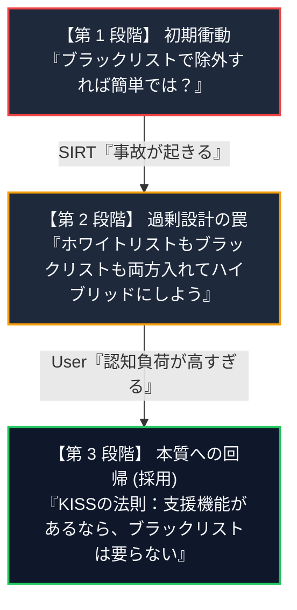
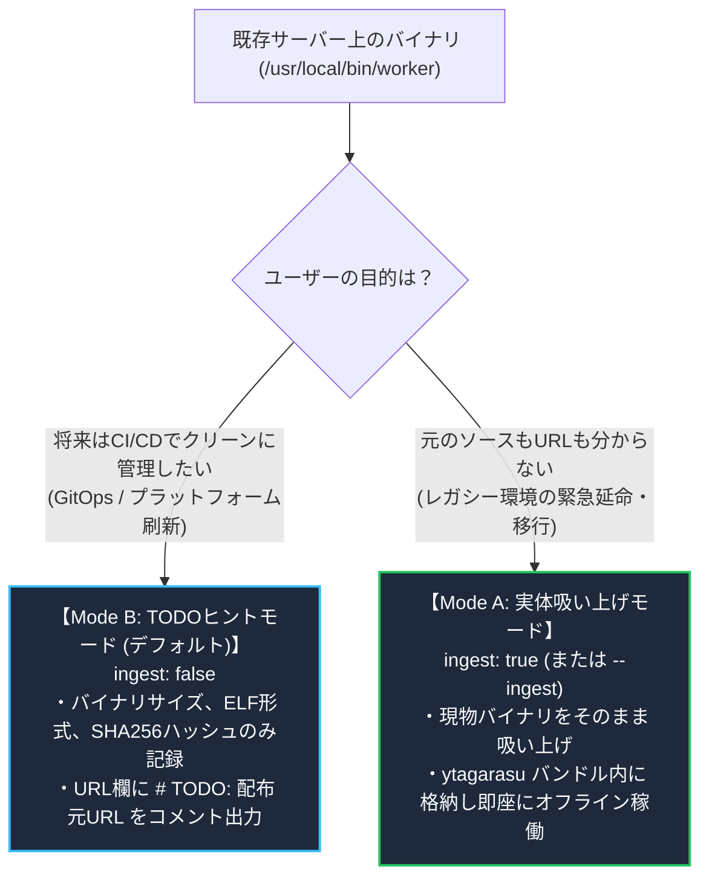

<!--
Copyright 2026 [Copyright Holder]

Licensed under the Apache License, Version 2.0 (the "License");
you may not use this file except in compliance with the License.
You may obtain a copy of the License at

    http://www.apache.org/licenses/LICENSE-2.0

Unless required by applicable law or agreed to in writing, software
distributed under the License is distributed on an "AS IS" BASIS,
WITHOUT WARRANTIES OR CONDITIONS OF ANY KIND, either express or implied.
See the License for the specific language governing permissions and
limitations under the License.

Author: [YOUR_NAME]
-->

# マニフェスト作成支援機能：設計の検討過程と意思決定ストーリー (Design Journey & Rationale)
**Why and How We Designed Manifest Discovery: From Complex Hybrid to KISS Whitelist Workflow**

---

## 1. はじめに：なぜこのドキュメントを公開するのか？

`ytagarasu` に新設される「マニフェスト作成支援（リバースエンジニアリング）機能」は、既存サーバーの稼働状態から `manifest.yaml` を自動生成する強力な機能です。
しかし、その設計の過程では **「現場の使いやすさ」「セキュリティの絶対原則」「認知負荷の爆発」** の間で激しい議論と葛藤がありました。

安易な「とりあえずオプションを増やしてハイブリッドにする」という誘惑を退け、**「KISSの法則（Keep It Simple, Stupid）」** に立ち戻ってシンプルな体験に着地した検討プロセスを、本リポジトリに関わるすべての開発者・運用者・セキュリティ担当者に共有します。

---

## 2. 検討の経緯と 3 つのフェーズ

本機能の設計は、以下の 3 つの段階を経て洗練されました。

---

### 第 1 段階：初期アイデア「ブラックリスト（`.ytagarasuignore`）で除外すればよい」
- **発想**:
  「サーバーのディレクトリやファイルを吸い上げて、不要なものは `.gitignore` のように `.ytagarasuignore` で除外できるようにすれば便利だろう。」
- **直面した壁（セキュリティ審査の壁）**:
  - セキュリティ担当（SIRT）からの指摘:
    > 「サーバー全体から除外していく方式（ブラックリスト）は、**『除外を書き忘れたファイルがすべて外部に出てしまう』** という致命的な欠陥がある。`/root/.ssh` や別部署の機密データが誤ってマニフェストに混入する事故が防げない。セキュリティの鉄則は **Deny by Default（ホワイトリスト）** である。」
- **結論**:
  ブラックリスト単独のアプローチは、セキュリティ的に即座に却下されました。

---

### 第 2 段階：過剰設計の罠「単純ハイブリッドと多重評価ルール」
- **発想**:
  「では、ホワイトリスト（`--scan-dirs`）で範囲を絞り、その内側にブラックリスト（`.ytagarasuignore`）を被せるハイブリッドにしよう。最長一致ルールや否定パターン（`!`）、競合解決マトリクスを定義すれば完璧だ。」
- **直面した壁（認知的負荷と責任放棄）**:
  - 運用者・レビュー担当者からの指摘:
    > 「ハイブリッドと言うが、それは安易すぎるのではないか？
    > ユーザーは何を基準にオプションを選べばいいか分からない。
    > さらに、ホワイトリストとブラックリストの両方を使われた場合、『どっちが優先されるのか』『ネストの深さでどう判定されるのか』をユーザーに考えさせるのは**認知負荷の押し付け**だ。
    > いいですか、ここには **KISSの法則** を適用すべきです。ユーザー体験に複雑なものを持ち込んではいけません。」
- **反省点**:
  「多機能であること」と「良いユーザー体験」を取り違え、ユーザーに複雑なルールの理解を強いる過剰設計（Over-engineering）に陥っていました。

---

### 第 3 段階：本質への回帰「ホワイトリスト支援一本化 ＆ ブラックリスト完全撤廃」
- **核心の気付き**:
  > **「ホワイトリスト作成を支援する『下見（survey）』機能があるなら、そもそもブラックリスト別ファイルなんて要らないのではないか？」**
- **KISSな解決策**:
  1. `ytagarasu discover survey` がサーバーを安全に下見して、候補を `discovery-plan.yaml` にリストアップする。
  2. ユーザーはそのファイルを開き、**「要らない行を消す（または `#` を付ける）」** だけ。
  3. `ytagarasu discover generate` は、プランに残った行だけを 100% 忠実にマニフェスト化する。

これで、`.ytagarasuignore` も、最長一致優先度ルールも、否定パターン構文も、**すべてプロダクトから追放**できました。

---

## 3. なぜこの設計が優れているのか？（3 つの観点での比較）

| 比較項目 | 従来の単純ハイブリッド案 | 採用された KISS ホワイトリスト支援案 | なぜ後者が優れているか |
| :--- | :--- | :--- | :--- |
| **設定ファイルの数** | 2つ以上 (`discovery-plan.yaml` + `.ytagarasuignore`) | **1つだけ** (`discovery-plan.yaml` のみ) | 設定の散乱がなく、Single Source of Truth (SSOT) が保たれる。 |
| **ユーザーの除外操作** | glob パターン構文の学習 (`logs/**`, `!logs/keep.txt`) | **エディタで行を消すだけ** (Deleteキー または `#`) | 学習コストがゼロ。直感的で誰でも迷わない。 |
| **ルールの優先度・競合** | 最長一致、階層評価、衝突時除外など複雑な推論が必要 | **推論不要** (「書かれている行だけが入る」WYSIWYG) | 「何が取り込まれるか」を疑う必要が一切ない。 |
| **セキュリティ保証** | 書き忘れによる漏洩リスクの懸念が残る | **完全な Deny by Default** (ビルトイン安全弁で秘密鍵自動マスク) | SIRT の承認を 100% 確実に取得できる。 |
| **チームレビュー** | 複数ファイルの突き合わせが必要 | **`git diff` 1 ファイルで完結** | プルリクエストの承認が圧倒的に迅速・安全。 |

---

## 4. バイナリ出所不明問題への現実的落とし所（Mode A vs Mode B）

既存サーバーをリバースエンジニアリングする際、もうひとつの現実的な壁は **「動いているバイナリの元リポジトリやビルドURLが分からない」** という問題です。

これに対して、イデオロギーを押し付けるのではなく、**ユーザーの状況に応じた 2 つのモード** をプランファイル内で選べるようにしました。

---

## 5. まとめ

「何でもできる複雑な道具」ではなく、**「迷わず安全に目的を達成できる道具」** を創る。
これが本リポジトリにおける開発とユーザー体験の不変の指針です。

- **仕様詳細**: [manifest_creation_support_prd_and_usecases.md](file:///Users/shjtmy/gravity/ytagarasu/docs/manifest_creation_support_prd_and_usecases.md)
- **技術決定記録**: [0006-manifest-discovery-and-whitelist-workflow.md](file:///Users/shjtmy/gravity/ytagarasu/docs/adr/0006-manifest-discovery-and-whitelist-workflow.md)
- **操作マニュアル**: [manual.md](file:///Users/shjtmy/gravity/ytagarasu/docs/manual.md)
