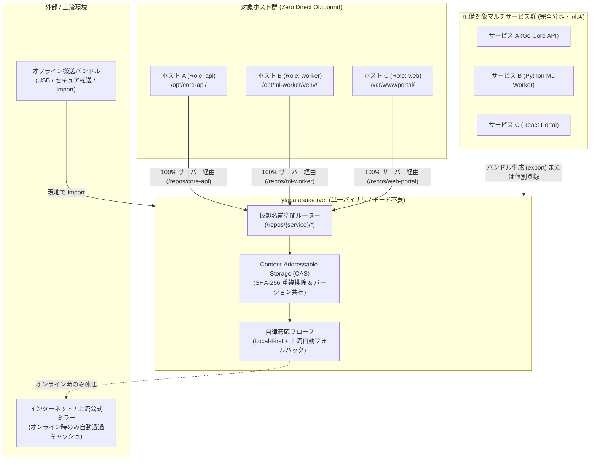
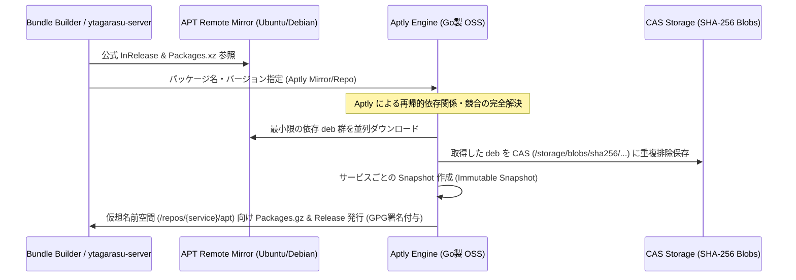
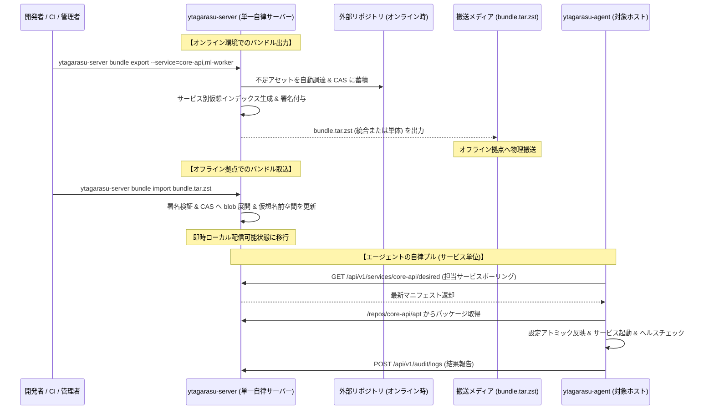
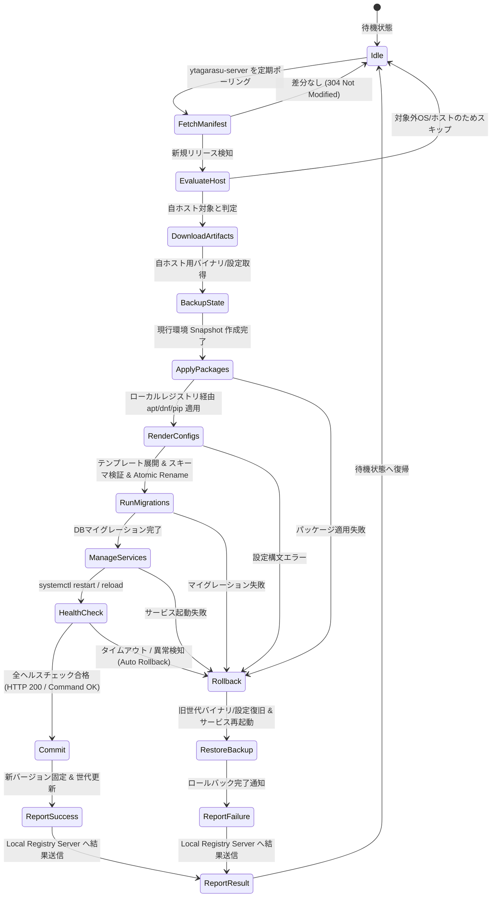

# オンプレミス向けオフライン対応デプロイ基盤 詳細設計書 & 開発計画

- **文書バージョン**: 1.0.0
- **策定日**: 2026-09-26
- **ステータス**: 承認済み (Approved) / 開発移行
- **対象読者**: プラットフォームエンジニア、SRE、インフラ担当者、セキュリティ監査人

---

## 1. エグゼクティブサマリ & 全体アーキテクチャ

### 1.1 背景と課題
オンプレミスおよび重要インフラ（金融・防衛・医療・通信・自治体等）の運用現場では、外部インターネットへの接続が遮断された「完全オフライン環境（Air-Gapped Environment）」での運用が求められます。
従来の運用では以下の課題が常態化していました。
1. **危険なSSH手動運用の常態化**: 踏み台サーバーを経由したSSH接続による手動コマンド実行やスクリプト適用が多発し、人為的ミスやセキュリティ監査の形骸化を招く。
2. **Ansible の過剰適用による管理複雑化**: 構成管理ツール（Ansible）を定常アプリケーションデプロイに常用した結果、オフライン環境内でのPlaybookの肥大化、Python依存関係の衝突、SSH鍵管理の負荷が増大。
3. **成果物の散乱と再現性の欠如**: アプリケーションバイナリ、設定ファイル、OSパッケージ（deb/rpm）が個別バラバラに搬送され、事後検証や確実なロールバックが極めて困難。

### 1.2 中核アーキテクチャコンセプト: ローカルファースト自律適応型エンジンとマルチサービス完全仮想分離

従来のデプロイ基盤やリポジトリサーバーが抱えていた「オンライン用／オフライン用サーバーの二重化によるユーザー体験の毀損」および「サービス間のパッケージ競合によるサーバー乱立の非効率」を根本解決するため、本基盤は **「自律適応型ローカルファースト（Adaptive Local-First）」** と **「マルチサービス仮想名前空間（Multi-Service Virtual Namespacing）」** を中核アーキテクチャとして採用します。

#### 【設計方針 1】サーバーの「モード（Online/Offline）」という二元論の完全撤廃 (Zero Mode Awareness)
「運用者がオンライン用とオフライン用のサーバーを使い分けなければならない」「agent が相手サーバーのモードを意識しなければならない」という構造は、ユーザー体験を著しく損ないます。本基盤では `--mode=online` や `--mode=offline` といった起動フラグ・二元論を **完全に撤廃** します。

- **単一の自律適応型エンジン (Adaptive Local-First Engine)**:
  サーバーは常に同一の `ytagarasu-server` バイナリであり、同一の設定で起動します。リクエスト受領時、以下のロジックで自律適応（Adaptive）して振る舞います。
  1. **ローカル照会 (Local-First)**: インポート済みバンドルおよびローカルキャッシュを最優先照会。該当アセットが存在すれば **0ms 転送** で即座に応答（オフライン環境でも超高速）。
  2. **上流自律適応 (Adaptive Upstream Probe)**: ローカルに存在しない場合、サーバー自身の上流ネットワーク（インターネットまたは社内上流ミラー）への疎通性を自律検知。
     - **上流疎通可能（オンライン環境）**: 外部リポジトリ（GitHub/APT/PyPI）から自動的にオンデマンド取得し、ローカルの Content-Addressable Storage (CAS) にキャッシュしてクライアントに透過返却。
     - **上流疎通不能（オフライン環境）**: 外部接続のタイムアウトを待たず、**即座に「ローカル完結（Offline）」として振る舞い**、未インポートである旨の確定的エラー（「サービスXのバンドル未インポート」）を即時返却。
- **統一されたユーザー体験**:
  - 開発拠点（オンライン）でも、現地（オフライン）でも、動かすサーバーは全く同じ。
  - オフライン現地では、搬送したバンドルを `ytagarasu-server bundle import` するだけで、サーバーが自律的にローカルカタログを拡張します。
  - エージェント側も、サーバーが外部から引いたのかバンドルから取り込んだのかを一切意識する必要がありません（Zero Mode Awareness）。

#### 【設計方針 2】マルチサービス仮想名前空間と CAS による完全分離・同居 (1台で全社集約)
「複数サービスの依存関係が衝突するため、サービスごとに ytagarasu-server を用意しなければならない」という非効率を完全排除します。**1台の `ytagarasu-server` で数十〜数百のマイクロサービス・アプリケーションを安全に完全同居・集中管理** できます。

1. **仮想リポジトリ名前空間 (Virtual Repository Namespaces)**:
   サービスごとに独立した仮想リポジトリエンドポイントを提供し、パッケージインデックスを完全分離します。
   - APT: `https://<server>:8443/repos/<service-id>/apt/`
   - DNF: `https://<server>:8443/repos/<service-id>/rpm/`
   - PyPI: `https://<server>:8443/repos/<service-id>/pypi/simple/`
   - Artifacts: `https://<server>:8443/repos/<service-id>/artifacts/`
2. **Content-Addressable Storage (CAS) による重複排除と共存**:
   - バックエンドのファイル実体はすべて SHA-256 ハッシュによる CAS（`/var/lib/ytagarasu/storage/blobs/sha256/...`）で管理。
   - **重複排除 (Deduplication)**: 複数サービスが同じ `python3.12` や `libssl3` を要求しても、ストレージ上は 1 つの blob を共有（ディスク浪費を防止）。
   - **バージョンの競合ゼロ**: サービスAが `libssl3 (v3.0.2)` を要求し、サービスBが `libssl3 (v3.0.13)` を要求する場合でも、CAS 上に両方の blob が保存され、各サービスの仮想 `Packages.gz` は自分の必要なバージョンのみを参照するため、**パッケージの競合や破損は原理的に発生しません**。
3. **Python 実行環境の完全隔離**:
   ホスト上でも各サービスは独立した `/opt/<service-name>/venv` に構築され、サービス専用の Wheel エンドポイントを参照するため、Python ライブラリ（例: pydantic 1.x と 2.x）の衝突も 100% 排除されます。
4. **バンドルの柔軟な統合と追加インポート**:
   全社サービスをまとめた「全社統合バンドル（`bundle-enterprise.tar.zst`）」も、サービス個別の「単体バンドル（`bundle-core-api.tar.zst`）」も、1台の `ytagarasu-server` に自由に追加インポート可能です。

#### 【設計方針 3】apt, dnf, pip, バイナリの 100% サーバー経由化 (Zero Direct Outbound)
**「オンライン環境・オフライン環境に関係なく、すべての apt, dnf, pip, バイナリのインストール・ダウンロードは 100% `ytagarasu-server` を経由する」** 原則を徹底します。

- **対象ホストからの外部直接通信は完全遮断 (Zero Direct Outbound)**:
  対象ホストは公式 APT/YUM/PyPI や GitHub に直接接続しません（FWで完全遮断可能）。
- **エージェント設定の普遍性**:
  対象ホストの `/etc/apt/sources.list.d/ytagarasu.list` 等は、常に `https://<ytagarasu-server>:8443/repos/<service-id>/...` だけを向きます。

```text
[ 1台の ytagarasu-server で全社サービスを完全仮想分離・自律適応配信 ]
  対象ホスト群 (Go / Python / React / HTMX)
       │
       ▼ (サービスごとの仮想リポジトリエンドポイントへアクセス)
  ytagarasu-server (単一バイナリ・モード概念なし)
       ├─ 【仮想名前空間】/repos/core-api/    (APT / RPM / PyPI / Binary)
       ├─ 【仮想名前空間】/repos/ml-worker/   (APT / RPM / PyPI / Binary)
       ├─ 【仮想名前空間】/repos/web-portal/  (APT / RPM / PyPI / Binary)
       │
       ├─ 【ローカル CAS ストレージ】SHA-256 重複排除 & バージョン共存
       │
       ▼ (ローカルに存在しない場合のみ自律適応)
  上流ネットワーク (オンライン時: 自動プロキシ & キャッシュ / オフライン時: 即時ローカル完結エラー)
```

---

### 1.3 全体アーキテクチャ構成図



---

### 1.4 コンポーネントと実体バイナリ構成 (SSOT)

本基盤を構成する実体バイナリは **以下の 2 つのみ** に集約され、起動時の `--mode` 指定は不要です。

1. **`ytagarasu-server` (サーバーバイナリ)**:
   - マルチサービス仮想リポジトリ配信（APT, DNF, PyPI, バイナリ）。
   - Content-Addressable Storage (CAS) による重複排除と依存共存。
   - ローカルファースト自律適応エンジン（ローカルにあれば即答、オンライン時は自動上流プロキシ・キャッシュ、オフライン時は即座にローカル完結エラー）。
   - バンドル作成（`ytagarasu-server bundle export`）および取り込み（`ytagarasu-server bundle import`）。
2. **`ytagarasu-agent` (エージェントバイナリ)**:
   - 各対象ホスト（業務サーバー）に常駐。設定された `ytagarasu-server` の担当サービス仮想リポジトリに対して常時 HTTPS ポーリングを行い、指示されたリリースをプルして適用・自動ロールバック。自ホストの apt/dnf/pip の向き先もすべてこのサーバーに集約。サーバーの物理環境がオンラインかオフラインかを一切意識しない。

---

### 1.5 クラウドネイティブ OSS 積極採用スタック & 高性能ラップトップPC動作設計

本基盤では、**「ポータビリティの完全維持」「品質と信頼性の担保」「車輪の再発明の防止」** を目的に、CNCF（Cloud Native Computing Foundation）およびオープンソースコミュニティで実証されたクラウドネイティブ OSS を全面的・積極的に採用します。
同時に、オフライン環境・エアギャップ運用の絶対制約を踏まえ、**クラウドサービス（SaaS/PaaS）や重厚なオーケストレータ（Kubernetes等）への依存を 100% 排除**し、**「高性能ラップトップノートPC（8〜16GB RAM）1台の上で全スタックが軽快に自律動作する軽量リソースフットプリント」** を厳格に保証します。

#### 1.5.1 クラウドネイティブ OSS 採用マトリクス (8大領域)

| # | 領域 / 機能 | 採用クラウドネイティブ OSS | ガバナンス種別 | 採用理由・品質担保メカニズム | オフライン & ラップトップ適性 |
|---|---|---|---|---|---|
| 1 | **成果物パッケージング & CAS レジストリ** | **ORAS (OCI Registry As Storage)<br>+ OCI 1.1 Artifacts<br>+ Zot (OCI Native Registry)** | CNCF Sandbox / OCI 標準 | 独自アーカイブのバグや孤立化を根絶。Docker / Podman / Skopeo / ORAS CLI などの業界標準エコシステムと完全互換。 | **純 Go 製単一バイナリ (35MB RAM)**。<br>K8s 不要でローカルファイルシステム上で CAS として直接稼働。ORAS Go SDK (`oras.land/oras-go/v2`) を内包。 |
| 2 | **署名・改ざん防止・真正性検証** | **Sigstore Cosign<br>+ In-toto<br>+ Syft (Anchore)** | CNCF Graduated (Cosign / In-toto) | 業界標準の暗号署名プロトコル。SPDX / CycloneDX SBOM の In-toto アテスト検証を担保し、サプライチェーン攻撃を完全に防御。 | **完全ローカルオフライン検証ネイティブ対応**。<br>外部 Rekor / Fulcio 接続なしにオフライン公開鍵で署名・検証。Go ライブラリ内包、メモリ負荷は検証時の一瞬のみ。 |
| 3 | **機密情報・シークレット暗号化** | **SOPS (Secrets OPerationS)<br>+ age (モダン公開鍵暗号)** | CNCF Sandbox (SOPS) | クラウド KMS (AWS/GCP) 不要。YAML/JSON/ENV の「値のみ」を暗号化し、キー構造・コメントを維持することで、Git 差分監査性を両立。 | **外部 KMS 通信ゼロ**。<br>ノードごとの `age` 鍵ペアで完全ローカル透過復号。Go ライブラリ (`go.mozilla.org/sops/v3`) 内包、メモリ消費ほぼゼロ。 |
| 4 | **プライベート PKI & TLS 自動管理** | **Smallstep `step-ca`<br>+ ACME プロトコル (RFC 8555)** | オープンソース (Smallstep Labs) | 手動証明書更新による期限切れ障害（運用障害 No.1）を撲滅。Let's Encrypt と同等の ACME 自動発行・自動更新 (30日更新等) をオフラインで完全再現。 | **Go 製単一静的バイナリ (20MB RAM)**。<br>組み込み BadgerDB / SQLite で完結。Nginx や Go API が標準 ACME クライアントで自動連携可能。 |
| 5 | **OS パッケージリポジトリエンジン** | **Aptly (Debian/Ubuntu)<br>+ createrepo_c (RHEL/RPM)** | デファクト標準 OSS (Go製 Aptly) | 自作スクリプトによる依存関係欠落や GPG 署名不整合を根絶。Debian 公式互換のスナップショット管理と完全な依存ツリー解決を保証。 | **Go 製・外部デーモン不要**。<br>ファイルシステム上でインデックス (`Packages.gz`) を数秒で再構築。メモリ消費数十MB。 |
| 6 | **可観測性 (o11y: Metrics & Trace)** | **VictoriaMetrics Single-node<br>+ OpenTelemetry Go SDK<br>+ Grafana OSS** | Prometheus 互換 OSS / CNCF Graduated (OTel) | Prometheus API 100% 互換で既存 PromQL が動作。Prometheus 比でメモリ消費が 1/4〜1/5、ディスク使用量も半分以下と圧倒的に高効率。 | **単一 Go バイナリ (30MB RAM)**。<br>ラップトップ常駐時も CPU/メモリの負荷を全く感じさせず、即座にダッシュボード可視化。 |
| 7 | **プロセス・エージェントライフサイクル** | **Linux 標準 systemd<br>+ D-Bus API (`coreos/go-systemd`)<br>+ Dewy アーキテクチャ** | Linux Foundation / OS 標準 | Kubernetes などの重量級エージェントを持ち込まず、OS 標準の systemd に委ねることで、cgroups によるリソース分離・自動復旧を直接活用。 | **エージェント常駐メモリわずか 15MB**。<br>純 Go バイナリで D-Bus 経由でプロセスを確実制御。 |
| 8 | **メタデータ永続化 & 状態管理** | **`modernc.org/sqlite`<br>(CGO-free pure Go SQLite with WAL)** | オープンソース (パブリックドメイン) | 世界で最も堅牢にテストされた SQL エンジン。ACID トランザクション、単一ファイルバックアップ、ハッシュチェーン監査ログを確実に担保。 | **C コンパイラ不要・常駐メモリ数MB**。<br>外部 RDBMS（PostgreSQL 等）の起動オーバーヘッドをゼロ化。 |

#### 1.5.2 高性能ラップトップPC（8〜16GB RAM）での動作保証とリソース試算

本基盤は「分散クラスタのスケーリング」ではなく、オンプレミスの単一拠点・オフライン拠点をターゲットとした「垂直統合型（Vertical-Integrated）軽量アーキテクチャ」を採用しています。
全コントロールプレーンおよび可観測性スタックを同時に起動した場合のリソースフットプリントは下表の通りです。

```text
[ 高性能ラップトップノートPC (8〜16GB RAM) 上での完全自律稼働 ]
  RAM 総空き容量: 8,000MB〜16,000MB
  ─────────────────────────────────────────────────────────────
  ┌───────────────────────────────────────────────────────────┐
  │ Ytagarasu コントロールプレーン全体: 合計 約 145MB (< 200MB) │  ← 全体の 1〜2% 未満！
  │  ├─ ytagarasu-server (ORAS/CAS/自律適応): 35MB            │
  │  ├─ Smallstep step-ca (ローカル ACME PKI): 20MB           │
  │  ├─ VictoriaMetrics Single-node (メトリクス): 30MB         │
  │  ├─ Grafana OSS (可視化ダッシュボード): 45MB              │
  │  └─ ytagarasu-agent (検証用ローカル常駐): 15MB            │
  └───────────────────────────────────────────────────────────┘
```

| コンポーネント / OSS プロセス | 実装言語 / 形式 | メモリ消費 (アイドル時〜通常時) | CPU使用率 (アイドル時) | ディスク必要容量 (バイナリ実体) |
|---|---|---|---|---|
| **`ytagarasu-server`** (自律適応 + CAS + Aptly) | Go (単一静的バイナリ, CGO-free) | **約 35MB** | < 0.1% | ~ 38MB |
| **Smallstep `step-ca`** (ローカル ACME) | Go (単一静的バイナリ) | **約 20MB** | < 0.1% | ~ 42MB |
| **VictoriaMetrics Single-node** | Go (単一静的バイナリ) | **約 30MB** | < 0.2% | ~ 25MB |
| **Grafana OSS** | Go + 静的アセット | **約 45MB** | < 0.1% | ~ 75MB |
| **`ytagarasu-agent`** (ローカル検証用) | Go (単一静的バイナリ, CGO-free) | **約 15MB** | < 0.1% | ~ 22MB |
| **合計 (フルスタック同時稼働時)** | **すべて単一バイナリ / デーモン** | **約 145MB (最大でも < 200MB)** | **< 1.0%** | **~ 202MB** |

#### 1.5.3 クラウドサービス非依存とポータビリティの完全保証 (Zero Cloud Lock-in)

1. **マネージドクラウド API への非依存**:
   - AWS S3, GCP Cloud Storage, Azure Blob などの特定クラウド API を前提とせず、ローカルファイルシステム上の OCI Layout / CAS を直接ストレージとします（必要に応じて S3 互換 MinIO / さくらのクラウド オブジェクトストレージへ透過切り替え可能）。
   - AWS KMS / GCP KMS / HashiCorp Vault の代わりに、`age`（Ed25519/X25519）ローカル鍵による SOPS 暗号化を採用。
2. **Kubernetes (k8s) 非依存のシングルノード完結**:
   - K8s やコンテナランタイム（containerd/Docker）を必須とせず、Linux 標準の systemd プロセスとして直接稼働します。これにより、OS 起動時のオーバーヘッドや K8s コントロールプレーンによるギガバイト単位のメモリ浪費を完全回避。
3. **ラップトップから本番オンプレミスへの 100% 透過性**:
   - 開発者が自身のラップトップ（macOS / Linux / Windows WSL2）上で検証したマニフェスト、署名、暗号化シークレット、バイナリは、オフライン現地の物理サーバー（Ubuntu / Debian / RHEL）へ一切の変更なしにそのまま搬送・適用可能です。

#### 1.5.4 Dewy 連携と S3 オブジェクトストレージ設計 (内蔵 POSIX S3 ゲートウェイ基本 + RustFS 切替対応)

Dewy（`linyows/dewy`）のバイナリ転送モード（`server` / `assets` コマンド）は、アーティファクト取得元として S3 互換オブジェクトストレージ（または GitHub Releases / GCS）を必須とします（※ OCI レジストリはコンテナ運用専用）。
本基盤では、ラップトップノートPCでの単一バイナリ動作を維持しつつ、車輪の再発明を完全に回避するため、**「内蔵 POSIX S3 ゲートウェイ（解法 B）」をデフォルト**とし、**「RustFS（解法 A）」へも設定 1 つで切り替え可能なプラガブル設計**を採用します。

##### (1) デフォルト構成: 内蔵 POSIX S3 ゲートウェイ（単一バイナリ完結）
外部ストレージデーモンを増やさず、`ytagarasu-server` 単一静的バイナリの中で S3 互換エンドポイント（ポート `8443` または `9000`）を直接提供します。自作によるプロトコルのバグを排除するため、Go 製 OSS S3 ゲートウェイライブラリ（`versity/versitygw` 等、Apache-2.0）をストレージエンジンに組み込みます。

- **実際のストアの物理ディレクトリ構造**:
  ディスク上に通常のディレクトリ・ファイル（POSIX）として配置・管理されます。
  ```text
  /var/lib/ytagarasu/storage/s3/
  └── buckets/
      └── core-api/                             # S3 バケット名 (サービスID)
          ├── v1.4.1/                           # プレフィックス (セマンティックバージョン)
          │   ├── api-server                    # バイナリ実体 (通常の実行可能ファイル)
          │   └── checksums.txt                 # SHA-256 チェックサム一覧
          └── v1.4.2/
              ├── api-server
              └── checksums.txt
  ```
- **メタデータ管理と整合性**:
  - **Key / プレフィックス**: ディレクトリ階層をそのまま S3 キー（`core-api/v1.4.2/api-server`）にマッピング。
  - **Content-Length / LastModified**: OS のファイル属性（`stat.st_size`, `stat.st_mtime`）から直接取得。
  - **ETag**: 配置時に計算したハッシュ（拡張属性 `xattr` または組み込み SQLite WAL に保存）。
  - **ListObjectsV2**: OSS ゲートウェイエンジンがディレクトリを走査し、Dewy が要求する S3 準拠 XML を自動生成。
- **リソースと品質**:
  追加メモリはわずか **約 3〜5MB**。外部プロセス 0 個で Dewy のバイナリ転送が 100% 動作。

##### (2) プラガブル設計: RustFS (`rustfs/rustfs`) への透過切り替え
外部の本格的な S3 ストレージを活用したい場合、設定ファイルにより **RustFS**（Apache-2.0）へ透過的に切り替え可能です。

```yaml
# /etc/ytagarasu/server.yaml
s3_storage:
  # embedded: ytagarasu 内蔵 POSIX S3 ゲートウェイ (デフォルト / 単一バイナリ完結)
  # external: 外部 RustFS / MinIO 等へ透過プロキシまたは直接バインド
  mode: "embedded"
  listen_port: 8443
  data_dir: "/var/lib/ytagarasu/storage/s3"
  
  # mode が external の場合の設定例 (RustFS 連携)
  external:
    endpoint: "http://127.0.0.1:9000"
    region: "us-east-1"
    bucket: "ytagarasu-artifacts"
    access_key: "ytagarasu-admin"
    secret_key: "enc:sops:..."
```

これにより、**「開発・ラップトップPC・中小規模オンプレミスでは単一バイナリ（組み込み S3）」** で身軽に運用し、**「大規模・分散エンタープライズでは RustFS や外部 S3 クラスタ」** へと、コードの変更なしにシームレスに拡張できます。

---

## 2. 最初に決めるべき事項（11項目）の確定仕様

要件定義に基づき、基盤設計の根幹となる11の決定事項について、選定理由および技術仕様を策定しました。

| # | 決定項目 | 決定仕様 | 選定理由・技術根拠 |
|---|---|---|---|
| 1 | **対象OSとバージョン** | **Ubuntu 24.04 LTS (noble)<br>Debian 12 (bookworm)<br>RHEL 9 (Rocky/Alma 9互換)** | オンプレミスおよびエンタープライズで標準的に採用されるLTSディストリビューション。systemd v250+、OpenSSL 3.x系が共通して利用可能。 |
| 2 | **CPUアーキテクチャ** | **x86_64 (amd64)**<br>*(設計レベルで aarch64/arm64 拡張性を担保)* | オンプレミスサーバーの95%以上を占める amd64 をMVPターゲットとする。マニフェストおよびリポジトリ構造はマルチアーキテクチャ前提で設計。 |
| 3 | **アーカイブ & レジストリ形式** | **OCI 1.1 Artifacts / ORAS (Zot互換)<br>`.tar.zst` / `.tar.gz` (OCI Layout)** | 独自アーカイブの自作を避け、CNCF標準の OCI Image / Artifact 仕様を採用。Zot/ORAS により単一バイナリ・超軽量に動作し、標準ツール（`skopeo`, `oras`）と完全互換。 |
| 4 | **搬送経路とアクセス制御** | **USBメディア / 一時中継ホスト / エアギャップ共有** | ファイル受領時、成果物サーバーが「SHA-256チェックサム」「Cosignデジタル署名」「有効期限」「対応OS/Arch」の4段階受領バリデーションを強制。 |
| 5 | **バンドル最大サイズ** | **フル: 最大 2GB / 差分: 最大 100MB** | FAT32/exFAT/セキュアUSBメモリの制約を考慮。2GB超の極大パッケージ群は500MBごとのチャンク分割（Split Archive）をサポート。 |
| 6 | **署名鍵と真正性検証** | **Sigstore / Cosign (CNCF Graduated)<br>オフライン公開鍵検証** | 独自署名ロジックを排除し、業界標準の Cosign を採用。オフラインキーペアで署名・検証し、SBOM（SPDX/CycloneDX）の In-toto アテスト検証を担保。 |
| 7 | **秘密情報の管理方式** | **SOPS (CNCF Sandbox) + age 暗号化** | クラウドKMS不要の完全オフライン秘密管理。`age` 公開鍵によりYAML/JSONの値のみを暗号化し、対象ホストのノード鍵で透過復号。Git差分監査性を両立。 |
| 8 | **ローカル PKI / 証明書管理** | **Smallstep `step-ca` (ローカル ACME サーバー)** | Go製・単一バイナリ（20MB RAM）。オフライン環境で完全な ACME プロトコルを提供し、NginxやGo APIの証明書自動発行・自動更新（30日更新等）を実現。 |
| 9 | **成果物サーバー冗長化** | **MVP: 単一プロセス＋永続ボリューム<br>Phase 2: Keepalived / VIP または 2台同期** | MVPでは最小リソースで動くGo製単一バイナリ＋SQLiteを採用。万が一のサーバー障害時も対象ホストの既存アプリは自律稼働を継続可能。 |
| 10 | **パッケージ更新の承認単位** | **リリースバンドル単位の一括承認** | 個別の `.deb` や `.rpm` の単独更新は禁止し、アプリケーションと連動した「バンドル単位」で結合テスト・検証済みの状態でのみ承認・配布。 |
| 11 | **ロールバック保持世代数** | **直近 3 世代 (Active, Prev, Old)** | ディスク消費量を抑えつつ、直前世代（N-1）への即時フォールバックおよびN-2への緊急切り戻しを保証。古い世代は自動ガバナンスパージ。 |
| 12 | **監査ログ保存期間** | **最低 3 年間 (ローカル暗号化SQLite + 改変検知チェーン)** | 金融・重要インフラ監査（ISO 27001, SOC2, PCI-DSS）に準拠。SHA-256によるハッシュチェーン構造を持たせ、改ざんを数学的に検知可能とする。 |
| 13 | **動作環境リソース要件** | **高性能ラップトップPC での完全稼働保証<br>(メモリ消費合計 < 200MB)** | クラウドサービス（SaaS/PaaS）を一切排除し、Zot、step-ca、VictoriaMetrics、ytagarasu-server すべてが Go 静的バイナリとしてノートPC（8〜16GB RAM）で軽快に動作。 |

---

## 3. デプロイバンドル仕様

### 3.1 デプロイ対象スタック (Golang, Python, React, HTMX) とバンドルディレクトリ構造

本デプロイ基盤は、オンプレミス環境で稼働する以下の4大主要技術スタックを **配備対象アプリケーション (Deploy Targets)** として正式にサポートします。

1. **Golang (Go)**: 高速APIサーバー、バッチ、バックグラウンドデーモン（CGOフリー静的バイナリ）
2. **Python**: 機械学習・データ処理、FastAPI/Flask Webサービス（オフライン Wheel パッケージ群 & 独立 venv 自動構築）
3. **React**: フロントエンド SPA（Node.js不要の事前ビルド済み静的アセット群、Nginx/Webサーバー配信）
4. **HTMX**: サーバー駆動型動的UI（Go 内包型 `//go:embed` または Python/Jinja2 テンプレート結合型）

これらを1つの統一バンドルに包括して管理できる階層構造を定義します。

```text
bundle/
├── manifest.yaml                  # バンドル全体の定義・メタデータ (SSOT)
├── artifacts/                      # アプリケーション成果物
│   ├── golang/                    # [Go] コンパイル済みバイナリ
│   │   ├── api-server
│   │   └── api-server.sha256
│   ├── python/                    # [Python] アプリコード & オフラインWheel群
│   │   ├── app/                   # Python ソースコード (.py)
│   │   ├── wheels/                # オフラインインストール用 Wheel (.whl)
│   │   └── requirements.lock      # 固定依存リスト
│   ├── react/                     # [React] 事前ビルド済み静的アセット
│   │   └── dist/                  # index.html, assets/*.js, assets/*.css
│   └── htmx/                      # [HTMX] テンプレート & アセット
│       ├── templates/             # SSR テンプレート
│       └── static/js/htmx.min.js  # ローカル配布用 HTMX コア
├── packages/                      # OSごとの収集済みパッケージ (deb/rpm)
│   ├── ubuntu-24.04-amd64/        # python3, python3-venv, nginx 等
│   ├── debian-12-amd64/
│   └── rhel-9-amd64/
├── repositories/                  # 成果物サーバー公開用インデックス
│   ├── debian/ (Packages.gz)
│   ├── ubuntu/
│   └── rpm/ (repodata/repomd.xml)
├── configs/                       # 設定ファイルテンプレート
│   ├── api.yaml.tmpl              # Go アプリ設定
│   ├── python-service.env.tmpl    # Python サービス環境変数
│   ├── nginx-react.conf.tmpl      # React 静的配信 Nginx 設定
│   └── schema.json                # 設定値検証スキーマ
├── migrations/                    # DBマイグレーションファイル
│   ├── 0001_initial.up.sql
│   └── 0001_initial.down.sql
├── sbom/                          # 脆弱性・構成監査データ (SPDX/CycloneDX)
├── signatures/                    # Ed25519 署名ファイル
└── checksums                      # 全ファイルの SHA-256 チェックサム一覧
```

### 3.2 マニフェスト仕様 (`manifest.yaml`) とデプロイ先指定（セレクタ要件）

複数台・複数役割（Web, API, Worker, DB等）のサーバーが存在するオンプレミス環境において、「どの成果物を、どのサーバーの、どのパスに配置するか」を安全かつ宣言的に制御するため、マニフェストには **ホストセレクタ（`selector`）** と **配備先パス（`destination`）** を厳格に定義します。

#### デプロイ先指定の解決メカニズム
1. **エージェント側の属性定義 (`/etc/ytagarasu-agent/agent.yaml`)**:
   各対象ホストは自身のホスト名、所属ロール、ゾーンを保持します。
   ```yaml
   node:
     hostname: "api-worker-01"
     roles: ["api", "worker"]
     zone: "datacenter-1"
     os: "ubuntu-24.04-amd64"
   ```
2. **マニフェスト側の配備ルール (`manifest.yaml`)**:
   各アプリケーション・設定・サービスに `selector`（配備対象ノード条件）と `destination`（ホスト上の絶対パス）を明記します。
3. **エージェントの自律フィルタリング**:
   `ytagarasu-agent` はサーバーから受信したマニフェストのうち、**自身の `roles` や `hostname` に合致する定義ブロックのみを抽出して適用** します。該当しないサービス（例: DBノード定義）は自動的にスキップされます。

```yaml
version: "1.0"
bundleVersion: "2026.09.26.1"
release: "1.4.2"
createdAt: "2026-09-26T10:00:00Z"
expiresAt: "2027-09-26T10:00:00Z"
author: "Release Engineering Team <release@example.internal>"

targets:
  - os: "ubuntu"
    release: "24.04"
    arch: "amd64"
  - os: "rhel"
    release: "9"
    arch: "amd64"

# 配備対象アプリケーション群 (ノードセレクタと配備先パスを明記)
applications:
  # 1. Golang アプリケーション (API サーバー)
  - name: "core-api"
    type: "golang"
    selector:
      roles: ["api"]                     # ← 'api' ロールを持つホストにのみ配備
    artifact: "artifacts/golang/api-server"
    destination: "/usr/local/bin/api-server" # ← ホスト上の絶対配置先パス
    permissions: "0755"
    owner: "app"
    group: "app"

  # 2. Python アプリケーション (データ処理 / ML API)
  - name: "ml-worker"
    type: "python"
    selector:
      roles: ["worker"]                  # ← 'worker' ロールを持つホストにのみ配備
    sourceDir: "artifacts/python/app"
    destination: "/opt/ml-worker/app"
    venvPath: "/opt/ml-worker/venv"
    wheelsDir: "artifacts/python/wheels"
    requirementsFile: "artifacts/python/requirements.lock"
    pythonBinary: "/usr/bin/python3"
    owner: "app"
    group: "app"

  # 3. React フロントエンド (SPA)
  - name: "admin-portal"
    type: "react"
    selector:
      roles: ["web"]                     # ← 'web' ロールを持つホストにのみ配備
    distDir: "artifacts/react/dist"
    destination: "/var/www/admin-portal"
    owner: "www-data"
    group: "www-data"

  # 4. HTMX ダッシュボード (Go 内包またはサーバー駆動UI)
  - name: "htmx-dashboard"
    type: "htmx"
    selector:
      roles: ["api"]
    embeddedIn: "core-api" # Go バイナリ内に //go:embed 済み

# OSパッケージ依存定義 (セレクタごとの必須パッケージ)
packages:
  ubuntu-24.04-amd64:
    manager: "apt"
    items:
      - name: "libssl3"
        version: "3.0.13-0ubuntu3.4"
        selector: { roles: ["api", "worker"] }
      - name: "python3"
        version: "3.12.3-0ubuntu1"
        selector: { roles: ["worker"] }
      - name: "python3-venv"
        version: "3.12.3-0ubuntu1"
        selector: { roles: ["worker"] }
      - name: "nginx"
        version: "1.24.0-2ubuntu7"
        selector: { roles: ["web"] }
      - name: "ca-certificates"
        version: "20240203"
        selector: { roles: ["*"] }

  rhel-9-amd64:
    manager: "dnf"
    items:
      - name: "openssl-libs"
        version: "3.0.7-27.el9"

# アプリケーションサーバー TLS 証明書 & 秘密鍵の管理・配備定義 (Ytagarasu 管理下)
certificates:
  - name: "core-api-tls"
    selector:
      roles: ["api"]                     # 'api' ロールのホストに配備
    certPath: "/etc/ssl/certs/core-api.crt"
    keyPath: "/etc/ssl/private/core-api.key"
    permissions: "0600"
    owner: "app"
    group: "app"
    provisioning: "acme"                # クラウドネイティブ: Smallstep step-ca のローカル ACME 連携 (自動更新)
    acmeServer: "https://ytagarasu-server:9000/acme/acme/directory"
    commonName: "api.example.internal"
    dnsNames: ["api.example.internal", "localhost"]
    ipAddresses: ["127.0.0.1"]
    autoRenewDaysBeforeExpiry: 30
    reloadService: "ytagarasu-api"      # 証明書更新時に自動リロードするサービス
  - name: "nginx-web-tls"
    selector:
      roles: ["web"]
    certPath: "/etc/ssl/certs/web.crt"
    keyPath: "/etc/ssl/private/web.key"
    permissions: "0600"
    owner: "root"
    group: "root"
    provisioning: "encrypted_sops"      # クラウドネイティブ: CNCF SOPS + age で暗号化封入された秘密鍵をホスト鍵で復号
    encryptedKeyArtifact: "configs/certs/web.key.enc"
    certArtifact: "configs/certs/web.crt"
    reloadService: "nginx"

# 設定ファイル配置定義 (CNCF SOPS 暗号化シークレット対応)
configs:
  - template: "configs/app.yaml.tmpl"
    destination: "/etc/ytagarasu/app.yaml"
    permissions: "0640"
    owner: "app"
    group: "app"
    sopsEncrypted: true                 # SOPS + age による暗号化シークレット
    schema: "configs/schema.json"
    validateCommand: "/usr/local/bin/ytagarasu-api --validate-config {{.TempFile}}"

# systemd サービス制御定義
services:
  - name: "ytagarasu-api"
    action: "restart"
    unitFile: "configs/ytagarasu-api.service"
    timeoutSeconds: 30

# ヘルスチェック定義
healthChecks:
  - type: "http"
    endpoint: "http://127.0.0.1:8080/v1/system/healthz"
    expectedStatus: 200
    intervalSeconds: 2
    maxRetries: 10
  - type: "command"
    command: "/usr/local/bin/ytagarasu-api --health-check"
    expectedExitCode: 0

# ロールバックポリシー
rollback:
  autoOnFailure: true
  strategy: "immediate" # immediate | manual
  preserveBackupGenerations: 3
```

### 3.3 バンドル生成準備結果 (`preparation-result.yaml`)

オンライン環境のデプロイサーバー上でバンドル生成を試行した際、即座にアーカイブを作成するのではなく、事前分析結果を構造化データとして出力します。重大なリスクがある場合は `status: blocked` とし、物理メディアへの書き込みを拒否します。

```yaml
version: "1.0"
evaluatedAt: "2026-09-26T10:15:00Z"
status: "blocked" # ready | warning | blocked
application: "ytagarasu-api"
release: "1.4.2"

target:
  os: "ubuntu"
  version: "24.04"
  arch: "amd64"

# 必須ファイルの充足状況
requiredFiles:
  - path: "artifacts/ytagarasu-api"
    exists: true
    sha256: "e3b0c442..."
  - path: "configs/app.yaml.tmpl"
    exists: true
  - path: "configs/schema.json"
    exists: true

# 不足しているパッケージや成果物
missing:
  - name: "libsqlite3-0"
    type: "package"
    reason: "Ubuntu 24.04 (noble) のローカルキャッシュに該当パッケージが見つかりません"
  - name: "JWT_SIGNING_KEY"
    type: "secret_variable"
    reason: "設定テンプレート内で要求されているシークレット変数の定義が欠落しています"

# 容量とリソース見積もり
resourceEstimates:
  bundleSizeBytes: 145283920 # 約138MB
  installedSizeBytes: 384029100 # 約366MB
  requiredDiskFreeBytes: 1073741824 # 1GB推奨空き容量

# デプロイリスク評価
risks:
  - id: "DEP-001"
    severity: "critical"
    category: "dependency"
    description: "依存パッケージ libsqlite3-0 が解決できず、起動時リンクエラーとなる危険性があります"
    mitigation: "オンライン環境のリポジトリミラーを更新し、対象 deb を再取得してください"
  - id: "SEC-002"
    severity: "high"
    category: "security"
    description: "必須シークレット JWT_SIGNING_KEY が未指定です"
    mitigation: "オフライン対象ホストの /etc/deploy-agent/secrets.env に事前設定してください"
  - id: "RBK-001"
    severity: "low"
    category: "rollback"
    description: "初回デプロイのため、旧バージョンのロールバック資産が存在しません"
    mitigation: "問題発生時はサービス停止（停止状態への切り戻し）が行われます"
```

### 3.4 マニフェスト作成支援 CLI (`manifest init` / `generate` / `validate`)

利用者がゼロから数十行〜数百行の `manifest.yaml` を手書きする運用負荷と構文エラーを防止するため、CLI ツール（`ytagarasu-bundle` または `ytagarasu`）に **マニフェスト作成支援サブコマンド** を標準搭載します。

#### (1) 対話型ウィザード (`ytagarasu manifest init`)
プロジェクトルートでコマンドを実行すると、対話形式で構成（言語スタック、ホストロール、配備先パス、OSパッケージ、TLS証明書要否）をヒアリングし、妥当なデフォルト値が設定された `manifest.yaml` を生成します。
- プロジェクト種別の選択（Go / Python / React / HTMX / 複合構成）
- 配備先ロールの入力（例: `web`, `api`, `worker`）
- TLS 証明書利用の有無と発行方式（ローカル CSR 発行 / 暗号化封入）
- ヘルスチェックエンドポイントの設定

#### (2) プロジェクト自動検出スキャン (`ytagarasu manifest generate --auto`)
カレントディレクトリを静的解析し、存在する構成要素からマニフェスト定義を自動推論・雛形出力します。
- `go.mod` 検出時: Golang アプリケーション定義、バイナリ出力パス、systemd ユニット雛形を生成。
- `requirements.txt` / `pyproject.toml` 検出時: Python アプリケーション定義、venv パス、`pip download` 対象リストを自動生成。
- `package.json`（React / Vite 等）検出時: React 静的アセット定義、`distDir` および Nginx 配信設定ブロックを生成。
- `.service` / `Dockerfile` 検出時: サービス制御名や必要な OS パッケージ候補を自動抽出。

#### (3) スキーマ検証と事前構文診断 (`ytagarasu manifest validate` / `lint`)
- `manifest.schema.json` による型・必須キーの完全チェック。
- セレクタ（`roles`）とアプリケーション・パッケージの整合性検証（未定義ロールへの割り当て警告）。
- 存在しないアーティファクトパスや、不適切なファイルパーミッション（例: 秘密鍵に `0777` 指定等）の静的検出。

---

## 4. パッケージ収集と依存関係解決エンジン

オフライン環境ではインターネットアクセスが遮断されているため、OSのパッケージマネージャー（`apt` や `dnf`）が外部にリクエストを送るとタイムアウトで失敗します。本基盤では、オンライン環境の「Bundle Builder」内にディストリビューション別の依存関係解決エンジンを組み込みます。

### 4.1 Debian系 (Debian 12 / Ubuntu 24.04) パッケージエンジン (Aptly 統合)

独自スクリプトによる依存関係の欠落やメタデータ不整合を排除するため、Debian/Ubuntu パッケージ管理のデファクトスタンダードである **Aptly (Go製オープンソース)** をエンジンの中核に採用します。



1. **Aptly による完全な依存ツリー解決**:
   - Aptly の Go ライブラリ / CLI を利用し、指定されたパッケージ（例: `nginx`, `python3-venv`）から再帰的な依存グラフを展開。
   - `Pre-Depends`, `Depends` を厳格に解決し、循環依存も破綻なく正規化。
   - ベース OS（Ubuntu 24.04 / Debian 12）に最初から含まれる標準パッケージ（`Priority: required` / `essential: yes`）は過剰収集を防止するため除外。
2. **CAS ストレージとの連携と不変スナップショット (Immutable Snapshot)**:
   - ダウンロードされた `.deb` ファイルはすべて SHA-256 ハッシュで CAS に保存。
   - Aptly のスナップショット機能により、サービスごとのバージョン固定（Immutable）を保証し、後からのパッチ適用時もロールバックが 100% 保証される。
3. **ローカル APT インデックス生成と GPG 署名**:
   - 仮想エンドポイント `/repos/{service_id}/apt/` に応じた `Packages.gz` および `Release` を Aptly が自動生成。
   - オフライン用 GPG 秘密鍵により `Release.gpg` / `InRelease` に署名し、エージェント側の `apt-get` が警告なしに安全にインストール可能。

### 4.2 RHEL系 (RHEL 9 / Rocky Linux 9) パッケージエンジン (createrepo_c 統合)

RHEL 9 互換環境向けには、エンタープライズ Linux 標準の **createrepo_c** および Go 製 RPM パッケージャーを統合します。

1. **RPM メタデータ同期 & Provides 逆引き**:
   - `repomd.xml` および `primary.xml.gz` をオンラインリポジトリからパース。
   - パッケージが要求する Capability（共有ライブラリ `libcrypto.so.3()(64bit)` 等）を `Provides` 辞書から高速逆引き。
2. **createrepo_c によるリポジトリインデックス生成**:
   - 収集した `.rpm` 群に対して `createrepo_c --database --compatibility` を実行し、SQLite データベースを含む `repodata/repomd.xml`, `primary.xml.gz`, `filelists.xml.gz` を生成。
   - DNF / YUM のキャッシュ効率を最大化し、完全オフラインの RHEL ノードでも高速に依存関係が解決される。

### 4.3 言語・フレームワーク別オフラインデプロイメントパイプライン

オンプレミス環境で稼働する多様なワークロードを確実に配備するため、スタックごとのオフライン完結パイプラインを標準化します。

#### (1) Golang (Go) パイプライン
- **オンライン生成時**:
  - `CGO_ENABLED=0 go build -ldflags="-s -w" -trimpath` により完全静的リンクバイナリをビルド。
  - `artifacts/golang/{binary}` に配置し SHA-256 チェックサムを生成。
- **オフライン配備時**:
  - `deploy-agent` が対象ホストの `/usr/local/bin/{binary}` にアトミック配置。
  - OS依存関係は `libc` 等の最小限にとどまり、外部ランタイム不要で即時起動。

#### (2) Python パイプライン (FastAPI, Flask, バッチ, 機械学習)
完全オフライン環境で最もトラブルが発生しやすい「PyPIへの外部接続依存」を根絶するため、Wheelキャッシュとオフライン仮想環境（venv）の自動構築を統合します。
- **オンライン生成時**:
  - `pip download --dest artifacts/python/wheels/ -r requirements.txt --platform manylinux2014_x86_64 --only-binary=:all:` により、対象OS/Pythonバージョン向けの全依存 Wheel (`.whl`) を完全収集。
  - 依存バージョンを固定した `requirements.lock` を生成。
- **オフライン配備時**:
  - OSパッケージリポジトリから `python3`, `python3-venv` を先行インストール。
  - `deploy-agent` が隔離された venv を作成：
    ```bash
    python3 -m venv /opt/{app}/venv
    /opt/{app}/venv/bin/pip install --no-index --find-links=/tmp/bundle/artifacts/python/wheels -r requirements.lock
    ```
  - アプリケーションソースを配置し、systemd で `/opt/{app}/venv/bin/gunicorn` 等を管理・起動。
  - ロールバック時は、直前の venv ディレクトリ（`/opt/{app}/venv.backup-revX`）へのシンボリックリンク切り戻しにより0秒復帰。

#### (3) React パイプライン (SPA / フロントエンド)
- **オンライン生成時**:
  - `npm ci && npm run build`（Vite / Next.js static export 等）を実行し、本番用静的アセット群（`index.html`, `assets/*.js`, `assets/*.css`）を出力。
  - `artifacts/react/dist/` にそのまま封入。**オフライン環境に対象ホスト用の Node.js や npm は一切持ち込まない**。
- **オフライン配備時**:
  - OSパッケージリポジトリから `nginx`（または軽量HTTPサーバー）を導入。
  - `/var/www/{app}/releases/{release_id}` に静的アセットを配置し、現行シンボリックリンク `/var/www/{app}/current` をアトミックに切り替え。
  - 設定テンプレート `nginx-{app}.conf.tmpl` を展開・検証し、`systemctl reload nginx` を実行。

#### (4) HTMX パイプライン (超軽量・サーバー駆動動的UI)
- **オンライン生成時**:
  - **パターンA (Go 内包型)**: Go の `//go:embed static/js/htmx.min.js templates/*` を使用。HTMLテンプレートとHTMXライブラリが Go バイナリ内に完全内包されるため、追加ファイル配置ゼロで完結。
  - **パターンB (Python / Jinja2 結合型)**: アプリケーションの静的ディレクトリ内にローカル版 `htmx.min.js` を同梱し、CDN への外部リクエストを完全遮断。
- **オフライン配備時**:
  - パターンAは Go バイナリの起動のみでUIが即時利用可能。
  - パターンBは Python サービスの起動とともにローカルホストから即座にHTMX駆動のUIが配信される。

---

## 5. ytagarasu-server 詳細設計 (自律適応型ローカルファースト & マルチサービス仮想化)

`ytagarasu-server` は単一の Go バイナリであり、モード指定（`--mode`）なしで起動します。リクエストに応じてローカル資産と上流ネットワークを自動調停し、1台のサーバー上で全社・全サービスの仮想リポジトリを完全分離して提供します。

### 5.1 自律適応型ローカルファーストエンジン (Adaptive Local-First Engine)

```text
[ クライアント要求 (agent / apt / dnf / pip / curl) ]
                      │
                      ▼
[ ytagarasu-server: 仮想名前空間ルーター (/repos/{service}/*) ]
                      │
                      ├─ Step 1: ローカル CAS 照会 (Local-First)
                      │    └── バンドルインポート済み、またはキャッシュ済みの場合は 【0ms 即時返却】
                      │
                      └─ Step 2: 未キャッシュ時の上流自律適応 (Adaptive Probe)
                           ├─ 【上流接続可能 (オンライン環境)】
                           │    └── 外部 (GitHub/APT/PyPI) からオンデマンド取得 → CAS へキャッシュ → 返却
                           │
                           └─ 【上流接続不能 (完全オフライン環境)】
                                └── 外部アクセスを試行せず、即座に「ローカル完結 (Offline)」として
                                    「サービスXのバンドル未インポート」を確定的エラー (404/400) で即答
```

1. **ゼロモード起動**: サーバーは環境に依存せず同一の設定で起動し、バックグラウンドで上流疎通性（インターネットまたは社内ミラー）をハートビート監視します。
2. **決定論的オフライン防御**: オフライン環境下では、存在しないリソースへのリクエストに対してタイムアウトやハングを一切起こさず、即座に「オフライン完結モード：バンドル未登録」として的確な不足情報を返します。

### 5.2 マルチサービス仮想名前空間 & CAS（Content-Addressable Storage）

1台の `ytagarasu-server` で複数サービス（Core API, ML Worker, Web Portal 等）を完全同居させるため、**仮想リポジトリ名前空間** と **Content-Addressable Storage (CAS)** を採用します。

```text
/var/lib/ytagarasu/
├── storage/
│   └── blobs/sha256/              # 【CAS】ファイル実体 (全サービスで重複排除共有)
│       ├── 3a7b... (libssl3 v3.0.2)
│       ├── 9f1c... (libssl3 v3.0.13)
│       ├── b2e4... (python3.12)
│       └── c5d8... (torch-2.2.0-cp312-manylinux.whl)
│
└── namespaces/                     # 【仮想名前空間】サービスごとの独立インデックス
    ├── core-api/
    │   ├── apt/ (Packages.gz -> 3a7b, b2e4 を参照)
    │   └── artifacts/ (api-server binary)
    ├── ml-worker/
    │   ├── apt/ (Packages.gz -> 9f1c, b2e4 を参照)
    │   └── pypi/simple/ (index.html -> c5d8 を参照)
    └── web-portal/
        └── artifacts/ (dist.tar.gz)
```

1. **ストレージ重複排除 (Deduplication)**: 複数サービスが同じ OS パッケージや Python Wheel を要求しても、CAS 層で SHA-256 により同一ファイルは1つのみ保持されます。
2. **バージョンの競合・破損ゼロ**: サービス間で要求するライブラリバージョンが異なっても、それぞれの仮想インデックスが異なる blob を指し示すため、APT/DNF の依存ツリー破損が原理的に起こりません。
3. **サービス毎サーバー構築の完全排除**: 1台のサーバーで企業・システム内のすべてのマイクロサービスを安全に集約管理できます。

### 5.3 バンドルの作成 (Export) と取り込み (Import) のライフサイクル



### 5.4 マルチサービス対応 API エンドポイント設計

エージェントおよび管理者が利用するエンドポイントは、サービス単位で名前空間化されています。

#### (1) `GET /api/v1/services`
- **概要**: 登録されているサービス一覧とバージョン情報を取得。

#### (2) `GET /api/v1/services/{service_id}/desired?os=ubuntu&version=24.04&arch=amd64`
- **概要**: `ytagarasu-agent` が担当サービスについて定期ポーリングするエンドポイント。対象ホストが適用すべき最新の `manifest.yaml` を返す。
- **レスポンス**: `200 OK` (マニフェストJSON) または `304 Not Modified`

#### (3) `POST /api/v1/bundles/export`
- **概要**: 指定したサービス（または全サービス）の完成済みデプロイバンドル（`bundle.tar.zst`）を出力。オンライン時は不足分を外部から自動調達してパッケージ化。
- **リクエスト**: `{"services": ["core-api", "ml-worker"], "release": "1.4.2"}`

#### (4) `POST /api/v1/bundles/import`
- **概要**: 搬送メディアから取得した `bundle.tar.zst` をサーバーに取り込み、CAS および対象サービスの仮想名前空間を更新。複数バンドルの順次追加インポートが可能。
- **リクエスト**: `multipart/form-data` (`bundle_file=@bundle-2026.09.26.1.tar.zst`)

#### (5) `/repos/{service_id}/apt/*`, `/repos/{service_id}/rpm/*`, `/repos/{service_id}/pypi/*`, `/repos/{service_id}/artifacts/*`
- **概要**: サービスごとに完全仮想分離されたパッケージ・Wheel・バイナリ配信エンドポイント。

#### (6) `POST /api/v1/audit/logs`
- **概要**: 各ホストのエージェントから、サービス単位のデプロイ結果、ヘルスチェック成否、ロールバックログを受信・ハッシュチェーン蓄積。

### 5.5 メタデータ最適化アーキテクチャ（肥大化防止エンジニアリング）

仮想リポジトリ名前空間と CAS の採用に伴うメタデータの肥大化懸念に対し、本基盤は以下の 3 重の最適化アーキテクチャを実装します。

#### 1. スパース・クロージャ・インデックス (Sparse Closure Indexing)
- **肥大化しない理由**: Ubuntu や Debian の公式リポジトリ（`main`, `universe` 等）全体をそのままミラーすると、メタデータだけで 50MB〜100MB 超（6万件以上のパッケージ情報）に達します。
- **本基盤の方式**: `ytagarasu-server` は全件ミラーを行わず、**マニフェストに宣言されたトップレベルパッケージとその依存閉包（Dependency Closure: 1サービスあたり数十〜数百件）のみを抽出して仮想インデックス（`Packages.gz` / `repomd.xml`）を動的生成** します。
- **効果**: 生成される `Packages.gz` はわずか **数KB〜数十KB** で完結し、対象ホストの `apt-get update` は 1 秒未満で完了します。

#### 2. CGO-Free SQLite WAL による軽量高速メタデータストア
- メタデータ（Blob、SHA-256、サイズ、MIME、サービス仮想マッピング、タグ、リビジョン）は、単一の組み込み SQLite データベース（`/var/lib/ytagarasu/metadata.db`）で集中管理。
- B-Tree インデックスにより、数百万件のレコードに対してもサブミリ秒で検索可能。
- WAL（Write-Ahead Logging）モードにより、読み取り（エージェント配信）と書き込み（バンドルインポート）の完全ノンブロッキング並行性を保証。

#### 3. Mark-and-Sweep ガベージコレクション (GC)
- 各サービスの有効な世代（直近 N 世代のロールバック対象）から参照されなくなった孤立 Blob を自動検知。
- `ytagarasu-server storage gc`（定期 cron または CLI）により、参照カウントゼロのファイルを物理削除。
- メタデータおよびストレージ消費量は常に **O(サービス数 × 保持世代数)** の有界値に収まり、長期運用でも容量爆発が起きません。

---

### 5.6 出所検証 (Provenance)・可観測性 (o11y)・モード固定ガード

動的な自律適応エンジンだからこそ、「ローカルを使ったのか、上流を使ったのか」の厳格な検証可能性と監査性、および運用ポリシーによるモード固定を担保します。

#### 1. 出所トラッキング (Provenance Tracking)
すべての配信レスポンスに以下の出所検証ヘッダーを付与し、クライアント側およびネットワーク監査で即時検証可能とします。
- `X-Ytagarasu-Source: local_cas | upstream_proxy | bundle_import`
- `X-Ytagarasu-Digest: sha256:...`
- `X-Ytagarasu-Upstream-URL: https://...` (上流から調達した場合)
- `X-Ytagarasu-Bundle-ID: bundle-2026.09.26.1` (バンドル由来の場合)

さらに、改ざん防止監査ログ（ハッシュチェーン）に「どのホストが、何時何分に、どの出所（ローカルバンドル / 上流ミラー）のパッケージを取得して適用したか」を恒久記録し、SOC2/PCI-DSS 等のコンプライアンス監査に完全適合します。

#### 2. 可観測性 (Observability: o11y)
- **Prometheus メトリクス**:
  - `ytagarasu_artifact_served_total{service="core-api", source="local_cas|upstream_proxy", status="200"}`
  - `ytagarasu_upstream_latency_seconds_bucket` (上流取得レイテンシ)
  - `ytagarasu_cas_storage_bytes` / `ytagarasu_cas_blobs_total` (ストレージ消費量)
  - `ytagarasu_metadata_entries_total` (インデックスエントリ数)
- **構造化ログ (`log/slog`)**:
  出所情報を含めた構造化ログを出力（RED メソッド準拠）:
  ```json
  {"time":"2026-09-26T10:00:00Z","level":"INFO","msg":"artifact served","service":"core-api","artifact":"libssl3_3.0.13.deb","source":"local_cas","sha256":"9f1c...","duration_ms":0.4}
  ```

#### 3. 厳格モード固定オプション (Outbound Policy Guard)
デフォルトの自律適応（`local_first`）に加え、設定ファイル（`/etc/ytagarasu/server.yaml`）または環境変数で **アウトバウンドポリシーを明示的に強制固定** 可能です。
```yaml
# /etc/ytagarasu/server.yaml
outbound_policy: "strict_offline" # strict_offline | local_first | upstream_prefer
```
- **`strict_offline` (完全オフライン固定)**: 外部ネットワークへのアウトバウンド通信をコードレベルで完全遮断。未インポートのパッケージ要求時は即座に 404/400 を返却。「完全閉域本番環境で、外部アクセスを試行すること自体を監査ポリシー上禁止したい」防衛・金融水準の要件に 100% 準拠。
- **`local_first` (デフォルト)**: ローカル優先＋上流フォールバック。
- **`upstream_prefer`**: CI/ステージング環境用。常に最新の上流を確認。

---

### 5.7 脆弱性更新とバージョンアップ対応パイプライン (CI自動化 & オフライン緊急パッチ)

CVE 等のセキュリティ脆弱性更新が発生した際、CI による自動追従およびオフライン現場への安全な即時適用を以下の 3 つのルートで保証します。

```text
[ 脆弱性検知 (Dependabot / Trivy) ]
              │
              ▼
[ 1. CI 自動化パイプライン (GitHub Actions / GitLab CI) ]
    ├─ manifest.yaml のパッケージバージョン自動更新 (例: libssl3 3.0.13-0ubuntu3.4 -> 3.5)
    ├─ ytagarasu-bundle build (外部から修正 deb を調達 & CAS 封入)
    ├─ SBOM (SPDX/CycloneDX) 生成 & Trivy による再スキャン合格確認
    └─ パッチバンドル (patch-cve-2026.tar.zst) を出力
              │
              ▼ (物理メディア搬送 / セキュア転送)
[ 2. オフライン現場での受領 & 適用 ]
    ├─ 管理者が ytagarasu-server bundle import patch-cve-2026.tar.zst を実行
    ├─ CAS に新 blob が追加され、該当サービスの仮想 Packages.gz がアトミック更新
    ├─ ytagarasu-agent が自律ポーリングで検知し apt-get install --only-upgrade
    └─ ヘルスチェック合格でロールバック世代更新、監査ログに適用証跡を記録
              │
              ▼ (超緊急時)
[ 3. 緊急ホットフィックス CLI (ytagarasu-server patch apply) ]
    └── バンドル作成を待てない場合、管理者が単一の修正 .deb を直接サーバーに注入し即座に配信
```

---

## 6. 対象ホストエージェント (`ytagarasu-agent`) 詳細設計

`ytagarasu-agent` は、各対象ホスト上で systemd 常駐サービスとして動作する軽量な Go プロセスです。

> **【重要: ytagarasu-agent の透過的プル動作】**:
> `ytagarasu-agent` は、自身がオンライン環境にいるかオフライン環境にいるかを一切意識しません（完全な透過性）。
> 常に指定された `ytagarasu-server`（社内デプロイサーバー、またはオフライン拠点サーバー）に対して HTTPS ポーリングを行い、指示されたリリースに従って自ホストの OS・アプリケーションに必要な差分のみをプルして適用・自動ロールバックします。
> また、エージェントが完成済みデプロイバンドル（`bundle.tar.gz`）そのものを直接ダウンロード・解凍することは一切ありません。

### 6.1 デプロイライフサイクル・ステートマシン



### 6.2 安全な設定適用のメカニズム (Atomic Config Rollback)

設定ファイルの反映中にサーバーがクラッシュしたり、構文エラーのある設定が反映されてデーモンが起動不能になる事態を完全に防ぐため、以下の5段階トランザクションを強制します。

1. **Snapshot Current**:
   現行の設定ファイル（例: `/etc/ytagarasu/app.yaml`）をバックアップ領域（`/var/lib/deploy-agent/backups/rev-X/app.yaml`）へ複製。
2. **Template Rendering**:
   バンドル内の `configs/app.yaml.tmpl` に、対象ホストの環境変数および `/etc/deploy-agent/secrets.env` を注入し、同一ファイルシステム上の一時ファイル（`/etc/ytagarasu/.app.yaml.tmp.PID`）に出力。
3. **Syntax Validation**:
   マニフェストで指定された `validateCommand`（例: `/usr/local/bin/ytagarasu-api --validate-config {{.TempFile}}`）を実行。不正な値やパースエラーがあれば即座に中断。
4. **Ownership & Permissions**:
   `chown app:app` および `chmod 0640` を一時ファイルに対して実行。
5. **Atomic Rename (`renameat`)**:
   POSIX `rename()` システムコールを用い、アトミックに一時ファイルを正式配置パスへ上書き（不可分操作のため、不完全な読み取りが発生しない）。

### 6.3 クラウドネイティブ OSS 連携エージェント機能

エージェント自身が車輪の再発明を行わず、堅牢かつ安全に動作するために以下の OSS 連携機構を内包します。

#### 1. SOPS + age による透過的シークレット復号
- マニフェストで `sopsEncrypted: true` または `provisioning: encrypted_sops` が指定されている場合、エージェントは内包された SOPS Go ライブラリ（`go.mozilla.org/sops/v3`）を呼び出します。
- 対象ホストに事前配備された秘密鍵（`/etc/ytagarasu-agent/node.agekey`、パーミッション `0400`）を用いて、メモリ上で透過的に復号。
- 平文の秘密情報をディスクに永続化させず、対象アプリケーションの設定ファイル生成パイプラインへ不可分に引き渡します。

#### 2. Smallstep `step-ca` 連携によるローカル ACME 自動証明書更新
- エージェント内に軽量 ACME クライアント（`lego` 互換 Go モジュール）を内包。
- `certificates` 定義で `provisioning: acme` が指定されている場合、オフライン拠点内の `step-ca` サーバー（`https://ytagarasu-server:9000/acme/acme/directory`）に対してローカル ACME チャレンジを実行。
- 有効期限の 30 日前に自動で秘密鍵生成・証明書署名要求 (CSR)・取得を実行し、指定された `reloadService`（Nginx, Go API 等）を自動リロード。証明書切れによる障害をゼロ化します。

#### 3. Linux 標準 systemd D-Bus API 直接制御 (`coreos/go-systemd`)
- シェルコマンド（`systemctl restart` 等）の文字列呼び出しやパースを行わず、Go 製の `coreos/go-systemd/v22/dbus` を使用して systemd D-Bus ソケット（`/run/systemd/system/private` または `/var/run/dbus/system_bus_socket`）と直接バイナリ通信。
- ユニットの再起動、リロード、UnitFile の動的リロード（`daemon-reload`）、および起動失敗ステータス（`failed`, `activating` 等）のミリ秒単位での検知を正確に行い、自動ロールバックをトリガーします。

---

## 7. Ansible による初期ブートストラップ設計

Ansible の実行は「対象ホストの初期プロビジョニング」の1回のみに限定されます。デプロイ定常運用ではAnsibleもSSHも使用しません。

### 7.1 Ansible Role 設計 (`roles/deploy_agent`)

```yaml
# roles/deploy_agent/tasks/main.yml
---
- name: deploy-agent 実行グループを作成
  ansible.builtin.group:
    name: deploy-agent
    state: present
    system: true

- name: deploy-agent 実行ユーザーを作成
  ansible.builtin.user:
    name: deploy-agent
    group: deploy-agent
    home: /var/lib/deploy-agent
    shell: /usr/sbin/nologin
    system: true

- name: 必要なディレクトリ群を作成
  ansible.builtin.file:
    path: "{{ item }}"
    state: directory
    owner: deploy-agent
    group: deploy-agent
    mode: '0750'
  loop:
    - /etc/deploy-agent
    - /var/lib/deploy-agent
    - /var/lib/deploy-agent/backups
    - /var/log/deploy-agent

- name: deploy-agent バイナリを配置
  ansible.builtin.copy:
    src: "bin/deploy-agent-linux-amd64"
    dest: /usr/local/bin/deploy-agent
    owner: root
    group: root
    mode: '0755'

- name: トラストアンカー公開鍵 (Ed25519) を配置
  ansible.builtin.copy:
    src: "keys/release-signer.pub"
    dest: /etc/deploy-agent/release-signer.pub
    owner: root
    group: root
    mode: '0644'

- name: エージェント設定ファイル初期配置
  ansible.builtin.template:
    src: agent.yaml.j2
    dest: /etc/deploy-agent/agent.yaml
    owner: deploy-agent
    group: deploy-agent
    mode: '0640'

- name: 最小権限の sudoers 設定を投入
  ansible.builtin.copy:
    dest: /etc/sudoers.d/deploy-agent
    content: |
      # deploy-agent がパッケージ更新とサービス再起動のみを実行可能にする最小設定
      deploy-agent ALL=(ALL) NOPASSWD: /usr/bin/apt-get update, /usr/bin/apt-get install *, /usr/bin/dnf install *, /bin/systemctl reload *, /bin/systemctl restart *
    owner: root
    group: root
    mode: '0440'
    validate: '/usr/sbin/visudo -cf %s'

- name: systemd サービスユニットを登録・起動
  ansible.builtin.systemd:
    name: ytagarasu-agent
    enabled: true
    state: started

- name: プライベート CA ルート証明書をシステムストアへ追加
  ansible.builtin.copy:
    src: "certs/ytagarasu-ca.crt"
    dest: /usr/local/share/ca-certificates/ytagarasu-ca.crt
    owner: root
    group: root
    mode: '0644'
  notify: Update CA trust

# ハンドラー
handlers:
  - name: Update CA trust
    ansible.builtin.command: /usr/sbin/update-ca-certificates
```

### 7.2 Ansible と本基盤（Ytagarasu）の機能境界 & 制約条件 (Non-Goals)

「Ansible でできること」と「Ytagarasu が担うこと」の境界線を明確化し、本基盤が想定していない・困難な制約条件を定義します。

#### (1) 機能分担マトリクス

| 管理レイヤー / タスク | Ansible (初回ブートストラップのみ) | Ytagarasu (定常デプロイ・自律運用) | 理由・技術的背景 |
|---|:---:|:---:|---|
| **OSインストール・ハードウェア設定** | **担当** | 対象外 | 物理/VMプロビジョニングはインフラ基盤の責務。 |
| **ネットワーク・NIC・DNS初期設定** | **担当** | 対象外 | 通信確立前の設定はエージェント起動前に完了が必要。 |
| **ディスクLVM・ファイルシステム・マウント** | **担当** | 対象外 | パーティショニングやNFSマウントはOS基盤側で初期定義。 |
| **初期ユーザー・sudoers作成** | **担当** | 対象外 | エージェント実行権限のブートストラップ。 |
| **CAルート証明書初期配置** | **担当** | 対象外 | HTTPS通信確立のためのトラストアンカー配備。 |
| **エージェント (`ytagarasu-agent`) 配置** | **担当** | 対象外 | 初回導入時のみ実行。 |
| **定常アプリバイナリ / ソース配置** | 対象外 | **担当** | エージェントによるアトミック配置 & ロールバック。 |
| **設定ファイルの展開・バリデーション** | 対象外 | **担当** | スキーマ検証付きアトミック更新 (`renameat`)。 |
| **定常OSパッケージ (deb/rpm) 適用** | 対象外 | **担当** | レジストリ経由の完全ローカルインストール。 |
| **Python venv 構築・Wheel適用** | 対象外 | **担当** | オフライン Wheel による隔離環境自動構築。 |
| **systemd サービス起動・再起動** | 対象外 | **担当** | デプロイフロー内での安全な再起動・状態監視。 |
| **アプリサーバー TLS 証明書/秘密鍵の配備・更新** | 対象外 | **担当** | Nginx, Go API, gRPC 等の業務ワークロード用証明書配置 & サービス再読込。 |
| **ヘルスチェック & 自動ロールバック** | 対象外 | **担当 (核心)** | Ansible では極めて困難な、即時自律切り戻し保証。 |
| **改ざん防止監査ログ (ハッシュチェーン)** | 対象外 | **担当 (核心)** | 各ホストでのデプロイ証跡の数学的追跡性。 |

#### (2) 本基盤の制約条件・想定外事項 (Assumptions & Non-Goals)

本基盤の実装および運用において、**意図的にスコープ外（非対象）とする制約条件** は以下の4点です。

1. **OSカーネル更新およびOSリブートを伴うディストリビューションアップグレードの非対応**:
   - `ytagarasu-agent` 自身の実行環境であるOSカーネルの大規模更新やOS再起動は、エージェントプロセスの切断・ホスト停止を伴うため本基盤では扱いません（OS保守ウィンドウにおいて Ansible や手動保守手順で実施）。
2. **動的なハードウェア・インフラ構成変更の非対応**:
   - 稼働中ホストに対するNICの追加・削除、ストレージの動的パーティショニング変更等は対象外とします。
3. **複数ホストにまたがる複雑な分散オーケストレーション（跨ノードバリア同期）の非対応 (MVP)**:
   - 例: 「ノードAを停止 → ノードBを更新 → ノードCのDBマイグレーションを実行 → ノードAを復旧」といった複雑な分散ステップ実行はMVPでは行いません。
   - 各 agent は、自身に割り当てられた Desired State に向かって自律的に収束（Eventual Consistency）するモデルをとります。
4. **組織全体の包括的 IDaaS / 外部 PKI 認証局そのものの代替 (Non-Goal)**:
   - 各デプロイ対象アプリケーション（Go API, Nginx等）の TLS 証明書や秘密鍵の安全な配置・サービスリロード・CSR発行によるサーバー署名連携は Ytagarasu のスコープ内です。一方で、組織全体のルート認証局や従業員・デバイス向けの包括的 IDaaS / KMS 基盤そのものの代替は対象外とします。

---

## 8. フルバンドル・差分バンドル管理戦略

### 8.1 フルバンドル (Full Bundle) vs 差分バンドル (Delta Bundle)

| 項目 | フルバンドル (Full) | 差分バンドル (Delta) |
|---|---|---|
| **内容物** | 対象リリースの実行に必要な全バイナリ、全依存 `.deb`/`.rpm`、全設定 | 前回特定バージョンからの変更バイナリ、追加・更新されたパッケージのみ |
| **サイズ** | 100MB 〜 1GB | 5MB 〜 50MB |
| **搬送性** | 初回導入時、大規模OSアップグレード時、復旧時に使用 | 定常のパッチリリース、マイナーアップデートに最適 |
| **前提条件** | 前提バージョンなし（単体で100%自己復旧可能） | 対象ホスト/成果物サーバーが指定の `baseRelease` であることが必須 |
| **安全性** | 依存関係の欠落リスクがゼロ | `baseRelease` のハッシュが合致しない場合は即時 `blocked` 判定 |

### 8.2 差分バンドルの検証・適用ロジック

差分バンドルの `manifest.yaml` には以下のように `baseRelease` とその SHA-256 チェックサムを明記します。

```yaml
bundleType: "delta"
baseRelease: "1.4.1"
baseReleaseChecksum: "a1b2c3d4..."
targetRelease: "1.4.2"
```

成果物サーバーおよび `deploy-agent` は、現在管理されているバージョンが `baseRelease` と完全に一致することを確認してから差分パッケージを展開します。中間バージョンが飛んでいる場合は「差分適用不可（Chain Broken）」エラーを出力し、フルバンドルの投入を要求します。

---

## 9. セキュリティと監査証跡設計

### 9.1 TLS 秘密鍵・証明書アーキテクチャ (オフライン環境での 2 階層 PKI 運用)

完全オフライン環境では公的認証局（Let's Encrypt 等）による自動証明書発行が利用できません。そのため、本基盤では **「プラットフォーム制御プレーン」** と **「デプロイ対象アプリケーションサーバー（業務ワークロード）」** の 2 つの階層で TLS 証明書・秘密鍵をライフサイクル管理します。

```text
[ 組織内 PKI / ルート認証局 (プライベート CA) ]
  │
  ├─ 【第1層: プラットフォーム制御プレーン (Ytagarasu 自身)】
  │    ├─ ルート CA 証明書 (ytagarasu-ca.crt)
  │    │    └── 全対象ホストの OS 証明書ストア (/usr/local/share/ca-certificates/) へ Ansible で事前配布
  │    │        → ytagarasu-agent, apt, dnf, pip が警告なしで 100% 透過通信
  │    ├─ サーバー証明書 & 秘密鍵 (server.crt / server.key)
  │    │    └── ytagarasu-server (/etc/ytagarasu-server/tls/) のみに配置
  │    │        → 【最重要原則】デプロイバンドルには秘密鍵を絶対に含めない (Zero Secret in Bundle)
  │    └─ エージェント認証
  │         └── トークン認証または mTLS クライアント証明書 (agent.crt / agent.key)
  │
  └─ 【第2層: デプロイ対象アプリケーションサーバー (Core API, Nginx, Python, gRPC 等)】
       │  ※ Ytagarasu の管理スコープとして manifest.yaml で宣言的に制御
       ├─ 証明書配置パス (certPath: /etc/ssl/certs/app.crt)
       ├─ 秘密鍵配置パス (keyPath: /etc/ssl/private/app.key, mode: 0600)
       ├─ 発行・配備方式 (provisioning):
       │    ├─ ① acme 方式 (推奨・標準): Smallstep step-ca が提供するローカル ACME エンドポイントを
       │    │                             利用し、各ホストが Certbot/Lego/組み込みクライアントで自動発行・自動更新
       │    ├─ ② csr 方式: agent がホスト上で秘密鍵を生成、CSR を ytagarasu-server へ送り署名受領
       │    ├─ ③ encrypted_sops 方式: CNCF SOPS + age によりホスト公開鍵で暗号化した秘密鍵を
       │    │                          バンドルに封入し、agent が自ホスト鍵で復号配置
       │    └─ ④ external 方式: ホスト上に事前配置された秘密鍵を参照・バインド
       └─ 自動更新 & サービスリロード
            └── 有効期限監視 (autoRenewDaysBeforeExpiry) に基づき証明書更新時、
                manifest.yaml で指定された reloadService (nginx, core-api 等) を自動再読込
```

#### 第1層: プラットフォーム制御プレーンのライフサイクル管理 (Smallstep `step-ca`)
1. **調達・発行**: Go製・単一バイナリの **Smallstep `step-ca`** を `ytagarasu-server` と同居（または内包）。`ytagarasu-ca.crt`, `server.crt`, `server.key` を発行（有効期間 2〜5 年推奨、メモリ消費 ~20MB）。
2. **配布と初期信頼 (Bootstrap)**: ルート CA 証明書を Ansible で全ホストの OS トラストストアへ投入し `update-ca-certificates` を実行。
3. **サーバー証明書更新**: `ytagarasu-server` 上で証明書を差し替え、`systemctl reload ytagarasu-server` で即時反映（エージェント側の再設定不要）。

#### 第2層: デプロイ対象アプリケーションサーバーのライフサイクル管理
1. **マニフェストによる宣言的定義**: `manifest.yaml` の `certificates:` ブロックに、SANs（CommonName, dnsNames, ipAddresses）、配置先パス、パーミッション、更新時リロード対象サービスを定義。
2. **秘密鍵漏洩の防止**:
   - `acme` / `csr` 方式の場合、秘密鍵は対象ホストのメモリ内で生成され `/etc/ssl/private/` にパーミッション `0600` で直接書き込まれるため、バンドル内やネットワーク上に秘密鍵が流出するリスクが原理的にゼロとなります。
   - `encrypted_sops` 方式の場合、対象ホストの公開鍵（age）で暗号化されているため、他ノードや中継経路で閲覧されるリスクを防ぎます。
3. **自律更新とダウンタイムゼロリロード**: エージェントまたは ACME クライアントが有効期限を監視し、期限到来前に自律的に証明書を更新し、`systemctl reload <service>` を発火します。

---

### 9.2 Sigstore Cosign による暗号署名チェーンと改ざん検知

独自署名ロジックを排除し、CNCF 標準の **Sigstore / Cosign** を採用します。

1. **Cosign オフライン署名チェーン**:
   - OCI アーティファクトおよびバンドル（OCI Layout / tarball）に対して、オフライン生成した秘密鍵（`cosign.key`）でデジタル署名を実行。
   - SBOM（SPDX/CycloneDX）を `cosign attach sbom` で成果物に直接アタッチし、改ざん不能なサプライチェーン証明（In-toto Attestation）を付与。
   - 成果物サーバーおよび `ytagarasu-agent` は、公開鍵（`cosign.pub`）により 1 ビットでも改ざんがあればデプロイを即時遮断。
2. **改ざん検知機能付き監査ログ (Audit Trail)**:
   - 誰がいつインポートし、どのホストがいつデプロイに成功／失敗したかを記録。
   - 監査レコードごとに `PreviousRecordHash` を含めるブロックチェーン様のハッシュチェーンを採用し、事後的なDB書き換えやログ削除を数学的に検知。

---

### 9.3 CNCF SOPS + age によるシークレット暗号化アーキテクチャ

クラウド KMS（AWS KMS / GCP Cloud KMS 等）にアクセスできない完全閉域環境において、暗号化シークレットを安全に管理するため **SOPS + age** を採用します。

1. **`age` 非対称鍵暗号の採用**:
   - 各対象ホストは Ansible 初回ブートストラップ時に自身専用の `age` 秘密鍵（`/etc/ytagarasu/keys/node-age.key`, mode: `0400`）を保持。
2. **マニフェスト・設定テンプレートの暗号化**:
   - パスワード、APIキー、機密環境変数は、対象ホストの `age` 公開鍵を指定して `sops -e` で暗号化。
   - YAML のキー名は平文のまま値（Value）のみが暗号化されるため、Git レビューやスキーマ検証を阻害しません。
3. **アトミック展開時のインメモリ復号**:
   - `ytagarasu-agent` は設定ファイルをホストに展開する直前、ローカルの `age` 秘密鍵で一時的にインメモリ復号し、POSIX `rename()` によりパーミッション `0600` / `0640` で安全に書き込みます。

---

## 10. 開発ロードマップ & Issue分割（WBS）

### 10.1 フェーズ計画

- **Phase 1 (MVP: 4スプリント)**:
  - 基本マニフェスト仕様策定
  - Debian/Ubuntu & RHEL パッケージ解決エンジンの実装
  - フルバンドル生成 CLI (`ytagarasu-bundle`)
  - オフライン成果物サーバー (`ytagarasu-server`)
  - deploy-agent の基本プル・パッケージ適用・systemd再起動・ロールバック
  - Ansible 初期導入ロール
- **Phase 2 (エンタープライズ拡張: 3スプリント)**:
  - 差分バンドル（Delta）生成・適用エンジン
  - 7z 圧縮アルゴリズム対応 & チャンク分割搬送
  - SQLite 改ざん防止ハッシュチェーン監査ログ
  - Web UI ダッシュボード（スタンドアロン HTMX + Go embed）

---

### 10.2 Issue 1〜9 の詳細タスク & 完了条件 (DoD)

#### Issue 1: デプロイ定義の仕様を設計・作成支援CLIを実装する
- **目的**: アプリケーション（Go/Python/React/HTMX）、OSパッケージ、設定、TLS証明書、サービス、ヘルスチェックを宣言的に定義するスキーマ・パーサー、およびマニフェスト自動生成・対話型作成支援CLIの実装。
- **タスク**:
  - `manifest.yaml`（アプリケーションサーバー `certificates` 管理を含む）および `preparation-result.yaml` の JSON Schema 作成
  - Go言語によるパーサーおよびバリデータ構造体の実装
  - マニフェスト作成支援 CLI コマンド（`ytagarasu manifest init` による対話型ウィザード、`generate --auto` によるプロジェクト自動検出スキャン、`validate` / `lint` による事前スキーマ診断）の実装
  - 4大スタック（Go/Python/React/HTMX）を網羅したサンプルマニフェストの作成と単体テスト
- **完了条件**:
  - 不正なYAML構造（フィールド欠落、型不一致、未定義ロール指定）をパース・検証時に的確にエラー通知できること
  - `manifest init` または `generate --auto` により、プロジェクト構成要素から妥当な `manifest.yaml` 雛形を自動・対話生成できること
  - アプリケーションサーバー向け証明書（`certificates:`）定義およびホストセレクタ（`selector:`）を正しく抽出・検証できること

#### Issue 2: パッケージ依存関係を解決する
- **目的**: Ubuntu 24.04, Debian 12, RHEL 9 の依存パッケージを自動収集・解析するエンジンの実装。
- **タスク**:
  - APT メタデータパーサー（`Packages.xz`）および依存ツリー探索の実装
  - YUM/DNF メタデータパーサー（`repomd.xml`）および Capability 解決の実装
  - パッケージの並行ダウンロードとローカル保存
- **完了条件**:
  - インターネット接続環境において、指定したトップレベルパッケージから芋づる式に全依存 `.deb` / `.rpm` を漏れなく収集できること
  - 存在しないパッケージ名が指定された場合に即座に解決失敗理由をレポートできること

#### Issue 3: デプロイバンドルを生成する
- **目的**: 成果物、パッケージ、設定、SBOM、署名を1つの `.tar.gz` にまとめ、事前評価結果を出力する CLI を開発。
- **タスク**:
  - `ytagarasu-bundle build` コマンドの実装
  - 不足パッケージ、シークレット変数欠落を検知するリスク評価エンジン
  - `preparation-result.yaml` の `ready` / `warning` / `blocked` 判定ロジック
  - Ed25519 署名および `checksums` 生成
- **完了条件**:
  - 依存が欠落している場合、`status: blocked` となりバンドルが出力されないこと
  - 正常時に単一の `.tar.gz` バンドルが生成され、自己検証コマンドで整合性が確認できること

#### Issue 4: オフライン成果物サーバーを実装する
- **目的**: オフライン環境でバンドルを受領・検証し、APT/YUM リポジトリとバイナリ配布 API を提供するサーバー。
- **タスク**:
  - `ytagarasu-server` バイナリの作成
  - バンドルインポート API (`POST /api/v1/bundles/import`)
  - ローカル APT/RPM リポジトリの静的ファイルホスティング機能
  - リリース管理 SQLite データベースの実装
- **完了条件**:
  - 搬送された `.tar.gz` をインポートし、署名検証に成功したリリースのみが有効化されること
  - 対象ホストの `apt-get update` / `dnf makecache` がローカルサーバー経由で正常終了すること

#### Issue 5: `deploy-agent` を実装する
- **目的**: 対象ホスト上で成果物サーバーをポーリングし、自律的にデプロイを完結させるエージェント。
- **タスク**:
  - 定期ポーリングループおよび desired state の差分検知
  - 二重起動を防ぐファイルロック (`flock`)
  - OSパッケージマネージャーの非対話的実行 (`DEBIAN_FRONTEND=noninteractive apt-get install`)
  - 実行結果レポートの送信
- **完了条件**:
  - SSH接続なしで、成果物サーバーのバージョン更新を検知し自律適用されること
  - 途中で再起動しても状態が壊れず安全に再試行または復元できること

#### Issue 6: 設定ファイルの安全な適用とロールバックを実装する
- **目的**: 不正な設定によるサービス停止を防ぐアトミック更新と自動ロールバック。
- **タスク**:
  - Go `text/template` による設定ファイル生成
  - `validateCommand` 実行ラッパー
  - `renameat` によるアトミック置換
  - スナップショットバックアップおよび復元エンジン
- **完了条件**:
  - 設定バリデーションに失敗した場合、旧ファイルが完全に維持されること
  - サービス再起動後のヘルスチェック失敗時に旧設定・旧バイナリへ自動切り戻しが行われること

#### Issue 7: バンドルの署名・監査機能を実装する
- **目的**: 真正性の担保と、改ざん防止ハッシュチェーン付き監査ログの実装。
- **タスク**:
  - Ed25519 鍵ペア生成・署名・検証ユーティリティ
  - サーバー側の監査ログ蓄積テーブルとハッシュチェーン生成
  - 有効期限（`expiresAt`）検証ロジック
- **完了条件**:
  - 署名が無効、または期限切れのバンドルはインポート時に拒否されること
  - 監査ログテーブルのハッシュ不整合を検知できる監査コマンドを提供できること

#### Issue 8: 初期導入用 Ansible role を作成する
- **目的**: 対象ホストへ初回のみSSH接続し、エージェントを自動セットアップする Ansible role。
- **タスク**:
  - `roles/deploy_agent` の作成
  - ユーザー・グループ作成、パーミッション設定、バイナリ・公開鍵配置
  - sudoers 最小特権設定、systemd サービス起動
- **完了条件**:
  - `ansible-playbook -i hosts site.yml` を1回実行するだけで、エージェントが常駐稼働し初回ポーリングに成功すること
  - 2回実行しても冪等性が保たれること

#### Issue 9: フルバンドル・差分バンドルを管理する
- **目的**: 搬送データ量を最小化する差分更新エンジンの実装。
- **タスク**:
  - 旧リリースとの差分計算エンジン（追加/更新パッケージ・バイナリの抽出）
  - `ytagarasu-bundle diff` コマンドの実装
  - エージェント側の差分適用とベースバージョン検証
- **完了条件**:
  - 差分バンドルのみでバージョンアップが完了し、搬送サイズがフルバンドル比80%以上削減されること
  - ベースバージョンが異なる場合に適用が拒否されること

---

## 11. まとめ & 次のアクション

本設計により、**「SSHの完全排除」「Ansibleの初期限定化」「搬送前の100%事前リスク評価」「単一バンドル化」「確実な自動ロールバック」** を備えた、最高水準のオフラインデプロイ基盤が実現されます。

次の開発ステップとして、まずは **Issue 1（デプロイ定義スキーマの実装）** および **Issue 2（パッケージ収集エンジンのPoC）** の着手を推奨します。
