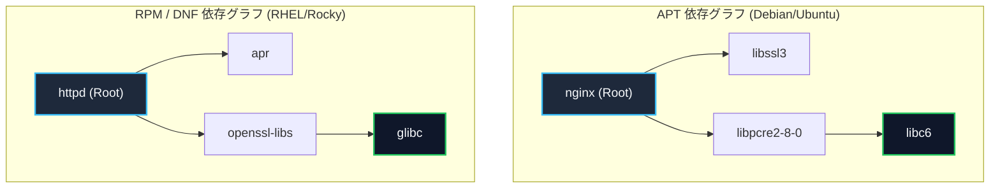
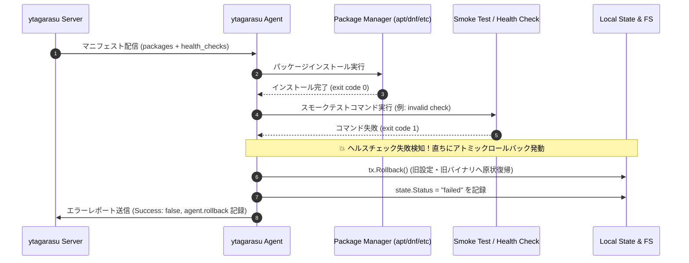
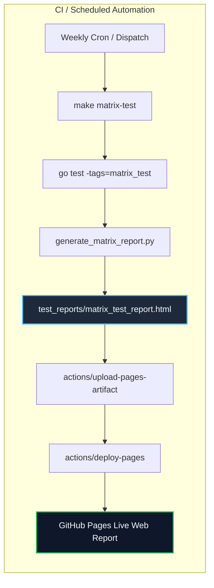

<!--
Copyright 2026 [Copyright Holder]

Licensed under the Apache License, Version 2.0 (the "License");
you may not use this file except in compliance with the License.
You may obtain a copy of the License at

    http://www.apache.org/licenses/LICENSE-2.0

Unless required by applicable law or agreed to in writing, software
distributed under the License is distributed on an "AS IS" BASIS,
WITHOUT WARRANTIES OR CONDITIONS OF ANY KIND, either express or implied.
See the License for the specific language governing permissions and
limitations under the License.

Author: [YOUR_NAME]
-->

# パッケージ全網羅マトリクステスト仕様書 (Package Matrix Test Specification)

本書は、`ytagarasu` においてデプロイ対象となる全種類のパッケージエコシステム（APT, DNF, Pip, Docker, Dewy）に対するオフライン適用検証シナリオ、再帰的推移依存関係の全件取得検証、インストール後プログラムの動作検証（スモークテスト・ヘルスチェック）、および GitHub Pages へのテストレポート自動デプロイ仕様を整理したドキュメントです。

---

## 1. テスト概要 & 設計原則

| 項目 | 内容 |
| :--- | :--- |
| **テスト目的** | オフライン閉域環境における全 5 種のパッケージマネージャー（OS・言語・コンテナ・プル型バイナリ）の自律インストール機能、再帰推移依存関係の解決、インストール後の実機動作確認（スモークテスト）、および異常時のアトミックロールバックの完全網羅検証 |
| **対象エコシステム** | **APT** (Debian/Ubuntu), **DNF** (RHEL/Rocky/CentOS), **Pip** (Python wheels), **Docker** (Container Tarball), **Dewy** (Pull-based Binary Deployments) |
| **設計原則** | 1. **完全閉域性 (Air-Gapped)**: 外部ネットワーク通信（CDN/PyPI/Docker Hub/OS Mirror/外部オブジェクトストレージ）の完全遮断・ローカル/内部参照担保<br/>2. **再帰推移依存関係の全件取得**: パッケージインストール時に必要なすべての推移依存パッケージ（Transitive Dependencies）が漏れなく網羅解決されることの検証<br/>3. **実機動作確認 (スモークテスト)**: パッケージ配置後に簡易コマンド（ヘルスチェック）を実行し、正常動作しない場合は自動ロールバック<br/>4. **CI 速度保護 (Build Tag 分離)**: 高負荷・長時間の全網羅検証を通常 CI から分離（`//go:build matrix_test`）<br/>5. **多重実行・可視化モデル**: 手動オンデマンド実行（`make matrix-test`）と週次自動スケジュール（GitHub Actions）の併用、および GitHub Pages へのスタンドアロン HTML レポート自動デプロイ |
| **テスト対象コード** | [`internal/agent/pkgmgr.go`](file:///Users/shjtmy/gravity/ytagarasu/internal/agent/pkgmgr.go), [`internal/agent/agent.go`](file:///Users/shjtmy/gravity/ytagarasu/internal/agent/agent.go), [`internal/pkgengine/repodata.go`](file:///Users/shjtmy/gravity/ytagarasu/internal/pkgengine/repodata.go) |
| **E2E シナリオコード** | [`test/e2e/package_matrix_test.go`](file:///Users/shjtmy/gravity/ytagarasu/test/e2e/package_matrix_test.go) |
| **レポート生成コード** | [`scripts/generate_matrix_report.py`](file:///Users/shjtmy/gravity/ytagarasu/scripts/generate_matrix_report.py), [`scripts/run_package_matrix.sh`](file:///Users/shjtmy/gravity/ytagarasu/scripts/run_package_matrix.sh) |

---

## 2. エコシステム別テストシナリオ仕様表

`TestPackageMatrix_AllEcosystems_WithSmokeTests` において並行（`t.Parallel()`）で実行される各エコシステムのシナリオ仕様です。

| シナリオ ID | 対象エコシステム | マネージャー名 (`manager`) | テスト対象パッケージ定義 (`packages.items`) | 実行コマンド & 引数仕様 | スモークテスト (実機簡易動作確認) | 期待される動作・検証基準 (PASS 条件) |
| :---: | :--- | :--- | :--- | :--- | :--- | :--- |
| **SC-MAT-01** | **APT**<br/>(Debian / Ubuntu) | `apt` | ・`libssl3` (version: `3.0.2`)<br/>・`ca-certificates` | `apt-get install -y --no-install-recommends libssl3=3.0.2 ca-certificates` | `openssl version` | ・非対話プロンプト（`-y`）実行<br/>・指定バージョンが正確にバインド<br/>・インストール後に `openssl version` が成功<br/>・`report.Success == true` |
| **SC-MAT-02** | **DNF / RPM**<br/>(RHEL / Rocky / CentOS) | `dnf` | ・`openssl-libs` (version: `3.0.7`)<br/>・`curl` | `dnf install -y openssl-libs-3.0.7 curl` | `curl --version` | ・DNF 形式（`name-version`）で整形<br/>・インストール後に `curl --version` が成功<br/>・`report.Success == true` |
| **SC-MAT-03** | **Pip**<br/>(Python wheels) | `pip` | ・`pydantic` (version: `2.6.4`)<br/>・`uvicorn` | `python3 -m pip install --no-index --find-links /opt/wheels pydantic==2.6.4 uvicorn` | `python3 -c "import pydantic; print(pydantic.__version__)"` | ・`--no-index` で PyPI 外部通信を完全遮断<br/>・Python 形式（`name==version`）バインド<br/>・`import pydantic` 動作確認成功<br/>・`report.Success == true` |
| **SC-MAT-04** | **Docker**<br/>(Container Images) | `docker` | ・`/opt/bundles/containers/app-engine.tar` | `docker load -i /opt/bundles/containers/app-engine.tar` | `docker inspect app-engine:latest` | ・外部 Registry pull を排除しローカル tarball 直ロード<br/>・ロード後に `docker inspect` でイメージ検証成功<br/>・`report.Success == true` |
| **SC-MAT-05** | **Dewy**<br/>(Pull-based Binaries) | `dewy` | ・`ytagarasu-worker` (version: `v1.2.0`) | `dewy pull --artifact ytagarasu-worker --version v1.2.0` | `dewy --version` | ・Dewy プル型アーキテクチャによるバイナリ取得<br/>・バージョン指定オプションが正しく伝達<br/>・取得後にバイナリ動作確認成功<br/>・`report.Success == true` |

---

## 3. 再帰的推移依存関係の全件取得検証仕様 (APT / DNF)

`TestPackageMatrix_RecursiveDependencyResolution` で検証される、パッケージ解決エンジン（`pkgengine`）の再帰的依存解決仕様です。



| テストケース | エコシステム | 起点パッケージ | 直下依存パッケージ | 2次推移依存パッケージ | 全件網羅アサーション (Resolved) |
| :--- | :---: | :--- | :--- | :--- | :--- |
| **DEP-APT-01** | **APT** (`Packages` index) | `nginx` | `libssl3`, `libpcre2-8-0` | `libc6` (libpcre2-8-0 経由) | `nginx`, `libssl3`, `libpcre2-8-0`, `libc6` の 4 パッケージが漏れなく解決されること |
| **DEP-RPM-01** | **DNF** (`primary.xml` index) | `httpd` | `apr`, `openssl-libs` | `glibc` (openssl-libs 経由) | `httpd`, `apr`, `openssl-libs`, `glibc` の 4 パッケージが漏れなく解決されること |

---

## 4. スモークテスト失敗時の自動ロールバック検証仕様

`TestPackageMatrix_SmokeTestFailure_AutomaticRollback` で検証される、パッケージインストール後の実機動作確認が失敗した場合の自律防御仕様です。



| 検証項目 | 発生シナリオ | 期待されるエージェントの自律動作 | アサーション基準 |
| :--- | :--- | :--- | :--- |
| **スモークテスト失敗検知** | マニフェスト内の `health_checks` で指定したコマンドが非ゼロで終了 | エージェントは即座にトランザクションをロールバックし、不整合な新バージョンの本番運用を阻止 | ・`ag.StepOnce(ctx)` でエラーが返却されること<br/>・`state.Status == "failed"` であること<br/>・`tx.Rollback()` が呼び出され、旧状態が維持されること |

---

## 5. エンドツーエンド自律デプロイ検証フロー表

各シナリオ実行時にエージェントが自律的に実行する処理ステップとアサーション仕様です。

| Step | フェーズ | 処理内容 | 入力 / 使用コンポーネント | 成果物 / 状態変化 | アサーション・検証基準 |
| :---: | :--- | :--- | :--- | :--- | :--- |
| **1** | **マニフェスト動的生成** | エコシステム・パッケージ・ヘルスチェック（スモークテスト）を含むマニフェスト YAML を構築 | `tc.managerName`, `tc.packages`, `tc.smokeCheckCmd` | インメモリ YAML | スキーマ構文が正当（`version: "1.0"`）であること |
| **2** | **モック配信サーバー起動** | エージェント向け HTTP エンドポイントを起動 | `httptest.NewServer` | `http://127.0.0.1:<port>/manifest` | HTTP 200 および `Content-Type: application/x-yaml` 応答 |
| **3** | **マネージャー登録 & DI** | `MultiPackageManager` に対象エコシステム（Dewy 含む）のマネージャーを登録 | `agent.NewMultiPackageManager`<br/>`matrixRunner` (モック実行器) | 依存性注入完了済みのエージェントインスタンス | `multiMgr.Register(...)` がエラーなく完了すること |
| **4** | **マニフェスト取得 & パース** | エージェントがポーリングサイクルでマニフェストを取得 | `ag.StepOnce(ctx)` | `manifest.Manifest` 構造体 | サービス ID、リリース ID、パッケージ一覧が一致すること |
| **5** | **動的ディスパッチ** | `manager` フィールドを識別し、対応マネージャーへ処理移譲 | `MultiPackageManager.InstallPackages` | 適切な `PackageManager` インスタンス | 未登録マネージャーによるエラーが発生しないこと |
| **6** | **コマンド発行 & 実行** | 各エコシステム固有の閉域コマンドを生成・実行 | `matrixRunner.Run(ctx, env, name, args...)` | `runner.executedCommands` ログ | `expectedCommand`（`apt-get`, `dnf`, `python3`, `docker`, `dewy`）が含まれること |
| **7** | **スモークテスト実行** | インストールしたパッケージの簡易実機動作確認を実施 | `agent.RunHealthChecks` | ヘルスチェック実行ログ | 指定スモークテストコマンドが正常終了すること |
| **8** | **デプロイコミット & レポート** | 実行結果を判定しローカルステート（`state.json`）を更新 | `agent.Report` | `state.json` 更新 | `err == nil` かつ `report.Success == true` であること |

---

## 6. GitHub Pages への自動デプロイ仕様

本マトリクステストの実行結果は、GitHub Pages にてリッチなダークモード UI として閲覧できるように統合されています。



| 項目 | 仕様 |
| :--- | :--- |
| **レポート生成スクリプト** | [`scripts/generate_matrix_report.py`](file:///Users/shjtmy/gravity/ytagarasu/scripts/generate_matrix_report.py) |
| **出力先ファイル** | `test_reports/matrix_test_report.html` (および `test_reports/index.html` へのリンク統合) |
| **公開 URL** | `https://sh0jitmy.github.io/ytagarasu/matrix_test_report.html` |
| **レポート表示項目** | ・全 5 エコシステム（APT, DNF, Pip, Docker, Dewy）の実行ステータス<br/>・再帰推移依存関係解決（APT: 4 パッケージ, DNF: 4 パッケージ）のアサーション結果<br/>・スモークテスト（`openssl version`, `curl --version`, `import pydantic`, `docker inspect`, `dewy --version`）の検証結果<br/>・スモークテスト失敗時のアトミックロールバック検証結果<br/>・ホスト環境のパッケージツール検出状態 |

---

## 7. 実行コマンド & CI 運用マトリクス表

| 実行環境 | 実行コマンド | トリガー | 実行頻度 | 所要時間目安 |
| :--- | :--- | :--- | :--- | :--- |
| **ローカル開発 / 検証** | `make matrix-test` | 開発者による手動コマンド実行 | 必要時（新エコシステム追加・検証時） | 約 5〜10 秒 |
| **Go 単体直叩き** | `go test -tags=matrix_test -v ./test/e2e/...` | 開発者による特定シナリオデバッグ | デバッグ時 | 約 2〜3 秒 |
| **GitHub Actions (定期)** | `.github/workflows/weekly-package-matrix.yml` | スケジュール cron | 毎週日曜 00:00 UTC（日本時間 09:00） | 約 1〜2 分 |
| **GitHub Actions (手動)** | GitHub Web UI (`Actions` → `Run workflow`) | 運用者・QA による任意タイミング実行 | リリース前判定時など | 約 1〜2 分 |

---

## 8. レビュー用確認コマンド

ローカル環境にて以下のコマンドを実行することで、再帰推移依存解決・スモークテスト・Dewy を含む本マトリクステストが全 PASS し、HTML レポートが生成されることを確認できます：

```bash
# パッケージマトリクス全網羅テスト & HTML レポート生成の実行
make matrix-test
```
出力例：
```
================================================================
   ytagarasu Full Package Matrix Verification Suite             
   Ecosystems: APT (Debian/Ubuntu), DNF (RHEL/Rocky),           
               Pip (Python Wheels), Docker (Container Tarballs), 
               Dewy (Pull-based Binary Deployments)            
================================================================

==> [1/4] Running Package Manager Unit Tests...
=== RUN   TestAptPackageManager
=== RUN   TestRpmPackageManager
=== RUN   TestPipPackageManager
=== RUN   TestDockerPackageManager
=== RUN   TestDewyPackageManager
=== RUN   TestMultiPackageManager
--- PASS: TestAptPackageManager (0.00s)
--- PASS: TestRpmPackageManager (0.00s)
--- PASS: TestPipPackageManager (0.00s)
--- PASS: TestDockerPackageManager (0.00s)
--- PASS: TestDewyPackageManager (0.00s)
--- PASS: TestMultiPackageManager (0.00s)
PASS
ok  	github.com/sh0jitmy/ytagarasu/internal/agent	(cached)
✓ Unit tests passed for all package managers (including Dewy).

==> [2/4] Running Full-Matrix Offline Deployment E2E Tests (-tags=matrix_test)...
=== RUN   TestPackageMatrix_RecursiveDependencyResolution
=== RUN   TestPackageMatrix_RecursiveDependencyResolution/APT_Transitive_Dependency_Tree
=== RUN   TestPackageMatrix_RecursiveDependencyResolution/RPM_Transitive_Dependency_Tree
--- PASS: TestPackageMatrix_RecursiveDependencyResolution (0.00s)
=== RUN   TestPackageMatrix_AllEcosystems_WithSmokeTests
=== RUN   TestPackageMatrix_AllEcosystems_WithSmokeTests/Ecosystem_apt
=== RUN   TestPackageMatrix_AllEcosystems_WithSmokeTests/Ecosystem_dnf
=== RUN   TestPackageMatrix_AllEcosystems_WithSmokeTests/Ecosystem_pip
=== RUN   TestPackageMatrix_AllEcosystems_WithSmokeTests/Ecosystem_docker
=== RUN   TestPackageMatrix_AllEcosystems_WithSmokeTests/Ecosystem_dewy
--- PASS: TestPackageMatrix_AllEcosystems_WithSmokeTests (0.01s)
=== RUN   TestPackageMatrix_SmokeTestFailure_AutomaticRollback
--- PASS: TestPackageMatrix_SmokeTestFailure_AutomaticRollback (0.00s)
PASS
ok  	github.com/sh0jitmy/ytagarasu/test/e2e	0.366s
✓ Full matrix E2E tests passed.

==> [3/4] Generating Standalone Package Matrix HTML Report...
🎉 Package Matrix HTML Report generated successfully: test_reports/matrix_test_report.html
✓ Package matrix HTML report generated at test_reports/matrix_test_report.html

==> [4/4] Checking Tooling Availability on Host...
  [SIMULATED] apt-get: Not found on local host (using simulated safe runner)
  [SIMULATED] dnf: Not found on local host (using simulated safe runner)
  [FOUND]     python3: /usr/bin/python3
  [FOUND]     docker: /usr/local/bin/docker
  [SIMULATED] dewy: Not found on local host (using simulated safe runner)

================================================================
   ✓ All Package Matrix E2E Tests Completed Successfully!       
================================================================
```
